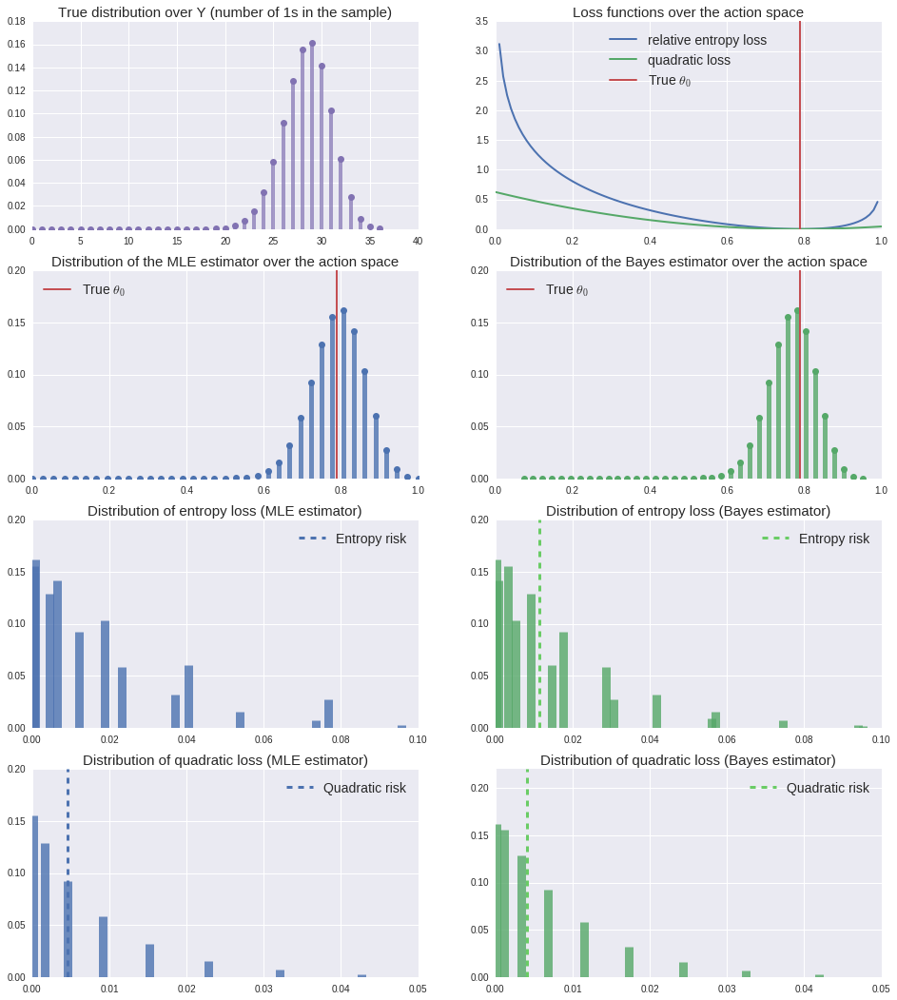
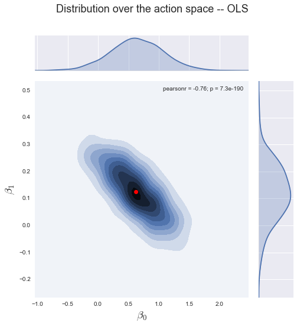
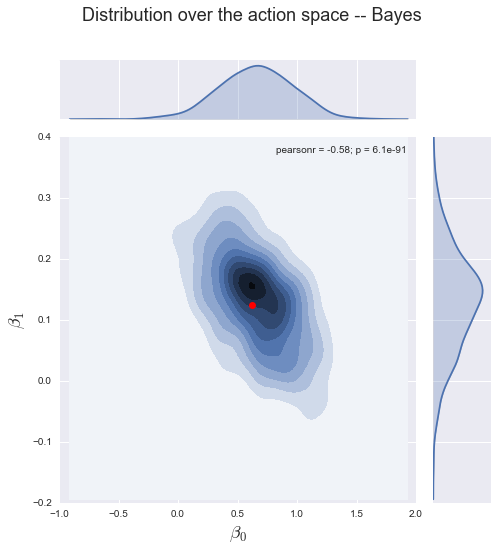
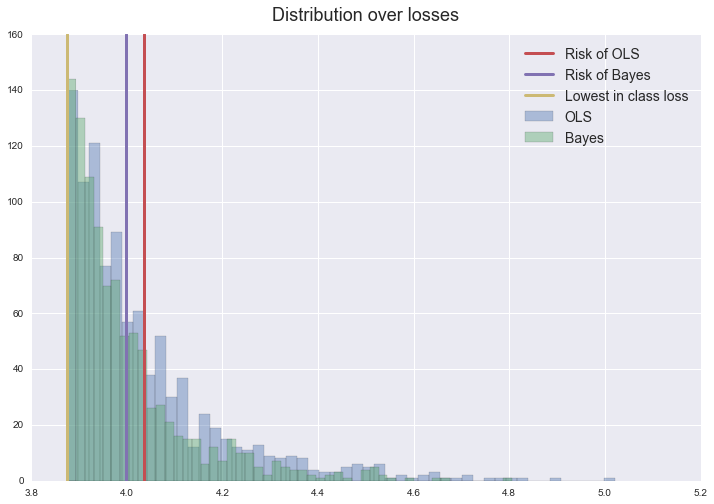

Estimators as Statistical Decision Functions
============================================

**Date: November 2016**

In this notebook we discuss some key concepts of statistical decision
theory in order to provide a general framework for the comparison of
alternative estimators based on their finite sample performance.

-  The primitive object is a statistical decision problem containing a
   loss function, an action space, and a set of assumed statistical
   models. We demonstrate that most estimation problems familiar from
   econometrics can be formulated as a statistical decision problem.

-  We compare estimators based on their (finite sample) risk, where risk
   is derived from an unknown true data generating mechanism.

-  We present some straightforward examples to illustrate the main
   ideas.

TO DO: Add Notations
~~~~~~~~~~~~~~~~~~~~

.. code:: python

    %matplotlib inline
    
    import numpy as np
    import scipy as sp
    import scipy.stats as stats
    import matplotlib.pyplot as plt
    import seaborn as sns
    import pandas as pd
    
    # For coin tossing
    from ipywidgets import interact, FloatSlider
    
    # For linear regression
    from scipy.stats import multivariate_normal
    from scipy.integrate import dblquad
    
    # Shut down warnings for nicer output
    import warnings
    warnings.filterwarnings('ignore')

Introduction
============

**TO DO: add links to QE lectures (ensemble, ergodicity, LLN)**

Stationarity and statistical models
^^^^^^^^^^^^^^^^^^^^^^^^^^^^^^^^^^^

The observed data are modelled as a partial realization of a stochastic
process :math:`\{Z_t\}_{t\in\mathbb{Z}}` taking values in
:math:`\mathbb{R}^{k}`. Denote a particular realization as the sequence
:math:`z^{\infty} \in \mathbb{R}^{k\mathbb{Z}}` and let the partial
history :math:`z^{n}` containing :math:`n` consecutive elements of the
realization be the *sample* of size :math:`n`. We assume that there
exists a core mechanism undelying this process that describes the
relationships among the elements of the vector :math:`Z`. Our aim is to
draw inference about this mechanism after observing a single partial
realization :math:`z^{n}`.

How is this possible without being able to draw different samples under
the exact same conditions? A fruitful approach is to assume that the
underlying mechanism is time invariant with the stochastic process being
strictly stationary and study its statistical properties by taking
long-run time averages of the realization :math:`z^{\infty}` (or
functions thereof) like

.. math:: \lim_{n\to \infty}\frac{1}{n}\sum_{t = 1}^{n} z_t\quad\quad \lim_{n\to \infty}\frac{1}{n} \sum_{t = 1}^{n} z^2_t\quad\quad \lim_{n\to \infty}\frac{1}{n}\sum_{t = k}^{n+k} z_{t}z_{t-k}

 Since the mechanism is assumed to be stable over time, it does not
matter when we start observing the process.

Notice, however, that strictly speaking these time averages are
properties of the particular realization, the extent to which they can
be generalized to the mechanism itself is not obvious. To address this
question, it is illuminating to bundle realizations that share certain
statistical properties together in order to construct an artificial
universe of (counterfactual) alternative :math:`z^{\infty}`-s, the so
called *ensemble*. Statistical properties of the data generating
mechanism can be summarized by assigning probabilities to (sets of)
these :math:`z^{\infty}`-s in an internally consistent manner. These
considerations lead us to the idea of a statistical model.

**Statistical models** are probability distributions over sequences
:math:`z^{\infty}` that assign probabilities so that the unconditional
moments are consistent with the associated long-run time averages. In
other words, with statistical models the time series and ensemble
averages coincide, which is the property known as **ergodicity**.
Roughly speaking, ergodicity allows us to learn about the ensemble
dimension by using a *single* realization :math:`z^{\infty}`.

Dependence
^^^^^^^^^^

In reality, however, being endowed only with a partial history of
:math:`z^{\infty}`, we cannot calculate the exact log-run time averages.
Nonetheless, by imposing more structure on the problem and having a
sufficinetly large sample, we can obtain reasonable approximations. To
this end, we need to assume some form of weak independence ("mixing"),
or more precisely, the property that on average, the dependence between
the elements of :math:`\{Z_t\}_{t\in\mathbb{Z}}` dies out as we increase
the gap between them.

Consequently, if we see a *long* segment of :math:`z^{\infty}` and cut
it up into shorter consecutive pieces, say of length :math:`l`, then, we
might consider these pieces (provided that :math:`l` is "large enough")
as nearly independent records from the distribution of the
:math:`l`-block. To clarify this point, consider a statistical model
:math:`Q_{Z^{\infty}}` (joint distribution over sequences
:math:`z^{\infty}`) with density function :math:`q_{z^{\infty}}` and
denote the implied density of the sample as :math:`q_{n}`. Note that
because of strict stationarity, it is enough to use the number of
consecutive elements as indices. Under quite general conditions we can
decompose this density as

.. math:: q_{n}(z^n) = q_{n-1}(z_n | z^{n-1})q_{n-1}(z^{n-1}) = q_{n-1}(z_n | z^{n-1})q_{n-2}(z_{n-1}|z^{n-2})\dots q_{1}(z_{2}|z_1)q_{1}(z_1)

For simplicity, we assume that the stochastic process is Markov so that
the partial histories :math:`z^{i}` for :math:`i=1,\dots, n-1` in the
conditioning sets can be replaced by the "right" number of lags
:math:`z^{n-1}_{n-l}` and we can drop the subindex from the conditional
densties

.. math:: q_{n}(z^n) = q(z_n | z^{n-1}_{n-1-l})q(z_{n-1}|z^{n-2}_{n-2-l})\dots q(z_{l+1}|z_{1}^{l})q_{l}(z^l) \quad\quad (1)

This assumption is much stronger than what we really need. First, it is
enough to require the existence of a history-dependent latent state
similar to the Kalman filter (!!link!!). Moreover, we could also relax
the Markov assumption and allow for dependence that dies out only
asymptotically. In practice, however, we often have a stong view about
the dependency structure, or at least we are willing to use economic
theory to guide our choice of :math:`l`, in which cases we almost always
assume a Markovian structure. For simplicity, in these lectures, unless
otherwise stated, we will restrict ourselves to the family of Markov
processes.

This assumption allows us to learn about the underlying mechanism
:math:`Q_{Z^{\infty}}` via its :math:`l+1`-period building blocks. Once
we determine the (ensemble) distribution of the block,
:math:`Q_{Z^{[l+1]}}`, we can "build up" :math:`Q_{Z^{\infty}}` by using
a formula similar to (1). Having said that the block distribution
:math:`Q_{Z^{[l+1]}}` carries the same information as
:math:`Q_{Z^{\infty}}`. Therefore, from now on, we define :math:`Z` as
the minimal block we need to know and treat it as an observation.
Statistical models can be represented by their prediction about the
ensemble distribution :math:`P` of this observable.

True data generating mechanism
^^^^^^^^^^^^^^^^^^^^^^^^^^^^^^

We assume that the mechanism underlying :math:`\{Z_t\}_{t\in\mathbb{Z}}`
can be represented with a statistical model :math:`P_0` and it is called
*true data generating process*. We seek to learn about the features of
this model from the observed data.

Primitives of the problem
-------------------------

Every statistical decision problem that we will consider can be
represented with a triple :math:`(\mathcal{H}, \mathcal{A}, L)`, where

1. **Assumed statistical models**,
   :math:`\mathcal{H}\subset \mathcal{P}` > A collection of statistical
   models (ergodic probability measures) over the observed data, which
   captures our *assumptions* about the data generating mechanism
   underlying :math:`\{Z_t\}_{t\in\mathbb{Z}}`. Ergodicity implies that
   with infinite data we could single out one element from
   :math:`\mathcal{H}`.

2. **Action space**, :math:`\mathcal{A}` > The set of allowable actions.
   It is an abstract set embodying our proposed *specification* by which
   we aim to capture features of the true data generating mechanism.

3. **Loss function**
   :math:`L: \mathcal{P}\times \mathcal{A} \mapsto \mathbb{R}_+` > The
   loss function measures the performance of alternative actions
   :math:`a\in \mathcal{A}` under a given distribution
   :math:`P\in \mathcal{P}`, where :math:`\mathcal{P}` denotes the space
   of strictly stationary probability distributions over the observed
   data. In principle, :math:`L` measures the distance between
   distributions in :math:`\mathcal{P}` along particular dimensions
   determined by features of the data generating mechanism that we are
   interested in. By assigning zero distance to models that share a
   particular set of features (e.g. conditional expectation, set of
   moments, etc.), the loss function can 'determine' the domain of
   effective actions.

Given the assumed statistical models, we can restrict the domain of the
loss function without loss in generality such that,
:math:`L: \mathcal{H}\times\mathcal{A} \mapsto \mathbb{R}_+`.

--------------

Examples
~~~~~~~~

**Quadratic loss:**

The most commonly used loss function is the quadratic

.. math:: L(P, a) = \int (z - a)^2\mathrm{d}P(z)

 where the action space is :math:`\mathcal{A}\subseteq \mathbb{R}^{k}`.
Another important case is when we can write :math:`Z = (Y, X)`, the loss
function is

.. math:: L(P, a) = \int (y - a(x))^2\mathrm{d}P(y, z)

 and the action space :math:`\mathcal{A}` contains some well behaving
real functions of :math:`X`.

**Relative entropy loss:**

When we specificy a whole distribution and are willing to approximate
:math:`P`, one useful measure for comparison of distributions is the
Kullback-Leibler divergence, or relative entropy

.. math:: L(P, a) = - \int \log \frac{p}{a}(z) \mathrm{d}P(z)

 in which case the action space is
:math:`\mathcal{A} = \{a: Z \mapsto \mathbb{R}_+ : \int a(z)\mathrm{d}z = 1 \}`.

**Generalized Method of Moments:**

Following the exposition of Manski (1994), many econometric problems can
be cast as solving :math:`T(P, \theta) = \mathbf{0}` in the parameter
:math:`\theta`, for a given function
:math:`T: \mathcal{P}\times\Theta \mapsto \mathbb{R}^m` with
:math:`\Theta\subseteq\mathbb{R}^p`. By expressing estimation problems
in terms of unconditional moment restrictions, for example, we can write
:math:`T(P, \theta) = \int g(z; \theta)\mathrm{d}P(z) = \mathbf{0}` for
some function :math:`g`. Taking an *origin-preserving continuous
transformation* :math:`r:\mathbb{R}^m \mapsto \mathbb{R}_+` so that

.. math:: T(P, \theta) = \mathbf{0} \iff r(T)=0

 we can present the problem in terms of minimizing a particular loss
function. Define the action space as :math:`\mathcal{A} = \Theta`, then
the method of moment estimator minimizes the loss
:math:`L(P, \theta) = r\circ T(P, \theta)`. The most common form of
:math:`L` is

.. math:: L(P, \theta) = \left[\int g(z; \theta)\mathrm{d}P(z)\right]' W \left[\int g(z; \theta)\mathrm{d}P(z)\right]

 where :math:`W` is a :math:`m\times m` positive-definite weighting
matrix.

--------------

Best in-class action
~~~~~~~~~~~~~~~~~~~~

By using a loss function, we acknowledge that learning about the true
mechanism might be too ambitious, so we better focus our attention only
on certain features of it and try to approximate those with our
specification. The loss function expresses our assessment about which
features are important and how deviations from the true features are
being punished. With a specified triple we can define **best in-class
action** as

.. raw:: latex

   \begin{equation}
   a^*_{L,\ P,\ \mathcal{A}} := \arg\min_{a \in \mathcal{A}} L(P,a).
   \end{equation}

Features
~~~~~~~~

Often, we denote by :math:`\gamma(P)`, the "feature" of distribution
:math:`P` that we are interested in estimating. We find it useful to
make the connection between the feature and the loss function. In
particular, the minimizer of the loss function on the broadest possible
domain determines the "true" feature, :math:`\gamma(P)`. When the action
space :math:`\mathcal{A}` is restricted, however, this feature might
differ from the best-in class action :math:`a^*_{L,\ P, \mathcal{A}}`
defined above. We can summarize this scenario compactly with
:math:`\gamma(P)\notin \mathcal{A}` and saying that the "specification"
:math:`\mathcal{A}` is misspecified. In such cases the loss function
plays a critical role by specifying the punishments for deviations from
the true :math:`\gamma(P)`. We will talk more about misspecification in
the following sections. A couple of examples should help clarifying the
introduced concepts.

-  **Conditional expectation -- regression function estimation** >
   Consider the quadratic loss function over the domain of all square
   integrable functions :math:`a: X \to \mathbb{R}`, where
   :math:`Z = (Y, X)` and :math:`Y` is a scalar. The corresponding
   feature is

   .. raw:: latex

      \begin{equation}
      \gamma(P) = \arg\min_{a \in L^2(X)} \int\limits_{(Y,X)} (y - a(x))^2\mathrm{d}P(y, x)
      \end{equation}

   and it is equal to the conditional expectation
   :math:`\gamma(P) = \mathbb{E}[Y|X]`. If the action space
   :math:`\mathcal{A}` does not include all square integrable functions,
   but only the set of affine functions, the best in class action, i.e.,
   the linear projection of :math:`Y` to the space spanned by :math:`X`,
   will be different from :math:`\gamma(P)` in general. In other words,
   the linear specification for the conditional expectation :math:`Y|X`
   is misspecified.

-  **Density function estimation** > Consider the Kullback-Leibler
   distance over the set of distributions with existing density
   functions. Denote this set by :math:`D_Z`. Given that the true
   :math:`P\in D_Z`, the corresponding feature is

   .. raw:: latex

      \begin{equation}
      \gamma(P) = \arg\min_{a \in D_Z} \int\limits_{Z}\log\left(\frac{p(z)}{a(z)}\right) \mathrm{d}P(z)
      \end{equation}

   which provides the density :math:`p\in\mathbb{R}_+^Z` such that
   :math:`\int p(z)\mathrm{d}z =1` and for any sensible set
   :math:`B\subseteq \mathbb{R}^k`,
   :math:`\int_B p(z)\mathrm{d}z = P(B)`. If the action space
   :math:`\mathcal{A}` is only a parametric subset of :math:`D_Z`, the
   best in class action will be the best approximation in terms of KLIC.
   For an extensive treatment see White (1994).

An important aspect of the statistical decision problem is the
relationship between :math:`\mathcal{H}` and :math:`\mathcal{A}`. Our
*maintained assumptions* about the mechanism are embodied in
:math:`\mathcal{H}`, so a natural attitude is to be as agnostic as
possible about :math:`\mathcal{H}` in order to avoid incredible
assumptions. Once we determined :math:`\mathcal{H}`, the next step is to
choose the specification, that is the action space :math:`\mathcal{A}`.

-  One approach is to tie :math:`\mathcal{H}` and :math:`\mathcal{A}`
   together. For example, the assumptions of the standard linear
   regression model outline the distributions contained in
   :math:`\mathcal{H}` (normal with zero mean and homoscedasticity), for
   which the natural action space is the space of affine functions.

-  On the other hand, many approaches explicitly disentangle
   :math:`\mathcal{A}` from :math:`\mathcal{H}` and try to be agnostic
   about the maintained assumptions :math:`\mathcal{H}` and rather
   impose restrictions on the action space :math:`\mathcal{A}`. At the
   cost of giving up some potentially undominated actions this approach
   can largely influence the success of the inference problem in finite
   samples.

By choosing an action space not "tied" to the set of assumed statistical
models, the statistician inherently introduces a possibility of bias --
for some statistical models there could be an action outside of the
action space which would fare better than any other action within
:math:`\mathcal{A}`. However, coarsening the action space in this manner
has the benefit of constraining the variability of estimated actions
arising from the randomness of the sample.

In this case, the best-in class action has a special role, namely, it
minimizes the "distance" between :math:`\mathcal{A}` and the true
statistical model, thus measuring the benchmark bias stemming from
restricting :math:`\mathcal{A}`.

Example - Coin tossing
----------------------

The observable is a binary variable :math:`Z\in\{0, 1\}` generated by
some statistical model. One might approach this problem by using the
following triple

-  *Assumed statistical models, :math:`\mathcal{H}`:* > \* :math:`Z` is
   generated by an i.i.d. Bernoulli distribution, i.e.
   :math:`\mathcal{H} = \{P(z; \theta): \theta \in[0,1]\}` > \* The
   probability mass function associated with the distribution
   :math:`P(z;\theta)\in\mathcal{H}` has the form

.. math:: p(z; \theta) = \theta^z(1-\theta)^{1-z}

-  *Action space, :math:`\mathcal{A}`:* > \* Let the action space be
   equal to :math:`\mathcal{H}`, that is
   :math:`\mathcal{A} = \{P(z, a): a\in[0,1]\} = \mathcal{H}`.

-  *Loss function, :math:`L`*: We entertain two alternative loss
   functions > \* Relative entropy

   .. raw:: latex

      \begin{equation}
      L_{RE}(P, a) = \sum_{z\in\{0,1\}} p(z;  \theta)\log \frac{p(z; \theta)}{p(z; a)} = E_{\theta}[\log p(z; \theta)] - E_{\theta}[\log p(z; a)]
      \end{equation}

       -  Quadratic loss

          .. raw:: latex

             \begin{equation}
             L_{MSE}(P, a) = \sum_{z\in\{0,1\}} p(z;  \theta)(\theta - a)^2 = E_{\theta}[(\theta - a)^2]
             \end{equation}

Example - Linear regression function
------------------------------------

In the basic setup of regression function estimation we write
:math:`Z=(Y,X)\in\mathbb{R}^2` and the objective is to predict the value
of :math:`Y` as a function of :math:`X` using the quadratic loss
function. Let :math:`\mathcal{F}:= \{f:X \mapsto Y\}` be the family of
all functions mapping from :math:`X` to :math:`Y`. The following is an
example for a triple

-  *Assumed statistical models, :math:`\mathcal{H}`*

    -  :math:`(Y,X)` is generated by an i.i.d. joint Normal
       distribution, :math:`\mathcal{N}(\mu, \Sigma)`, implying that the
       true regression function, i.e. conditional expectation, is going
       to be affine

-  *Action space, :math:`\mathcal{A}`*

    -  The action space is the set of affine functions over :math:`X`,
       i.e.
       :math:`\mathcal{A}:= \{a \in \mathcal{F} : a(x) = \beta_0 + \beta_1\cdot x\}`

-  *Loss function, :math:`L`*

    -  Quadratic loss function

       .. raw:: latex

          \begin{equation}
          L(P, f) = \int\limits_{(Y,X)}(y - f(x))^2\mathrm{d}P(y,x)
          \end{equation}

Statistical Decision Functions
==============================

As stated before, for each potential statistical model we choose the
optimal best in-class action where optimality is gauged by the loss
function.

.. raw:: latex

   \begin{equation}
   a^*_{L, P, \mathcal{A}} = \arg\min_{a\in\mathcal{A}}L(P,a).
   \end{equation}

If one knows the data generating process, there is no need for
statistical inference. What makes the problem statistical is that the
distribution :math:`P` describing the environment is not known. The
statistician can only base her action on the available data, which is a
realization of the underlying data generating mechanism. The time
invariant stochastic relationship between the data and the environment
allows the decision maker to carry out statistical inference regarding
the data generating process.

A statistical **decision rule** then is a function mapping samples (of
different sizes) to actions from :math:`\mathcal{A}`. In order to
flexibly talk about the behavior of decision rules as the sample size
grows, we define the domain of the decision rule to be the set of
samples of all potential sample sizes,
:math:`\mathcal{S}:= \bigcup_{n\geq1}Z^n`. The decision rule is defined
as a sequence of functions

.. raw:: latex

   \begin{equation}
   d:\mathcal{S} \mapsto \mathcal{A} \quad \quad \text{that is} \quad \quad \{d(z^n)\}_{n\geq 1}\subseteq \mathcal{A},\quad \forall z^{\infty}
   \end{equation}

Example (cont) - estimator for coin tossing
~~~~~~~~~~~~~~~~~~~~~~~~~~~~~~~~~~~~~~~~~~~

One common way to find a decision rule is to plug the empirical
distribution :math:`P_{n}` into the loss function :math:`L(P, a)` to
obtain

.. math:: L_{RE}\left(P_{n}; a\right) = \frac{1}{n}\sum_{i = 1}^{n} \log \frac{p(z_i; \theta)}{p(z_i; a)}\quad\quad\text{and}\quad\quad L_{MSE}\left(P_{n}; a\right) = \frac{1}{n}\sum_{i = 1}^{n} (z_i -a)^2

and to look for an action that minimizes this sample analog. In case of
relative entropy loss, it is

.. math:: d(z^n) := \arg \min_{a} L(P_{n}, a) = \arg\max_{a} \frac{1}{n}\sum_{i=1}^{n} \log f(z_i ,a) = \arg\max_{a}  \frac{1}{n}\underbrace{\left(\sum_{i=1}^{n} z_i\right)}_{:= y}\log a + \left(\frac{n-y}{n}\right)\log(1-a) 

 where we define the random variable :math:`Y_n := \sum_{i = 1}^{n} Z_i`
as the number of :math:`1`\ s in the sample of size :math:`n`, with
:math:`y` denoting a particular realization. The solution of the above
problem is the *maximum likelihood estimator* taking the following form

.. math:: \hat{a}(z^n) = \frac{1}{n}\sum_{i=1}^{n} z_i = \frac{y}{n}

and hence the **maximum likelihood** decision rule is

.. math:: d_{mle}(z^n) = P(z, \hat{a}(z^n))

It is straightforward to see that if we used the quadratic loss instead
of relative entropy, the decision rule would be identical to
:math:`d_{mle}(z^n)`. Nonetheless, the two loss funcions can lead to
very different assessment of the decision rule as will be shown below.

--------------

For comparison, we consider another decision rule, a particular Bayes
estimator (posterior mean), which takes the following form

.. math:: d_{bayes}(z^n) = P(z, \hat{a}_B(z^n))\quad\quad\text{where}\quad\quad \hat{a}_B(z^n) = \frac{\sum^{n}_{i=1} z_i + \alpha}{n + \alpha + \beta} = \frac{y + \alpha}{n + \alpha + \beta}

where :math:`\alpha, \beta > 0` are given parameters of the Beta prior.
Later, we will see how one can derive such estimators. What is important
for us now is that this is an alternative decision rule arising from the
same triple :math:`(\mathcal{H}, \mathcal{A}, L_{MSE})` as the maximum
likelihood estimator, with possibly different statistical properties.

Example (cont) - estimator for linear regression function
~~~~~~~~~~~~~~~~~~~~~~~~~~~~~~~~~~~~~~~~~~~~~~~~~~~~~~~~~

In this case the approach that we used to derive the maximum likelihood
estimator in the coin tossing example leads to the following sample
analog objective function

.. raw:: latex

   \begin{equation}
   d_{OLS}(z^n):= \arg\min_{a \in \mathcal{A}}L(P_{n},a) = \arg\min_{\beta_0, \ \beta_1} \sum_{t=1}^n (y_t - \beta_0 - \beta_1\cdot x_t)^2
   \end{equation}

With a bit of an abuse of notation redefine :math:`X` to include the
constant for the intercept, i.e. :math:`\mathbf{X} = (\mathbf{1}, x^n)`.
Then the solution for the vector of coefficients,
:math:`\mathbf{\beta}=(\beta_0, \beta_1)`, in the ordinary least squares
regression is given by

.. raw:: latex

   \begin{equation}
   \hat{\mathbf{\beta}}_{OLS} := (\mathbf{X}^T \mathbf{X})^{-1}\mathbf{X}^T \mathbf{Y}
   \end{equation}

Hence, after sample :math:`z^n`, the decision rule predicts :math:`y` as
an affine function given by :math:`d_{OLS}(z^n) = \hat{a}_{OLS}` such
that

.. raw:: latex

   \begin{equation}
   \hat{a}_{OLS}(x) := \langle \mathbf{\hat{\beta}}_{OLS}, (1, x) \rangle.
   \end{equation}

--------------

Again, for comparison we consider a Bayesian decision rule where the
conditional prior distribution of :math:`\beta` is distributed as
:math:`\beta|\sigma \sim \mathcal{N}(\mu_b, \sigma^2\mathbf{\Lambda_b}^{-1})`.
(:math:`\sigma^2=(1-\rho^2)\sigma_Y^2` in our joint normal
specification.) Then the decision rule is given by

.. raw:: latex

   \begin{equation}
   \hat{\mathbf{\beta}}_{bayes} := (\mathbf{X}^T \mathbf{X} + \mathbf{\Lambda_b})^{-1}(\mathbf{\Lambda_b} \mu_b + \mathbf{X}^T \mathbf{Y})
   \end{equation}

Hence, decision rule after sample :math:`z^n` is an affine function
given by :math:`d_{bayes}(z^n) = \hat{a}_{bayes}` such that

.. raw:: latex

   \begin{equation}
   \hat{a}_{bayes}(x) := \langle \mathbf{\hat{\beta}}_{bayes}, (1, x) \rangle.
   \end{equation}

Later we will talk more about Bayes estimators and the idea behind them.

Induced Distributions over Actions and Losses
=============================================

For each realization of the sample, :math:`Z^n = z^n`, the decision rule
assigns an action :math:`d(z^n)\in\mathcal{A}` which then can be
evaluated with the loss function :math:`L(P, d(z^n))` using a particular
distribution :math:`P`. However, this does not capture the stochasticity
of the sample. It is important to assess the decision rule in
counterfactual worlds with a different realization of the sample.

For each probability distribution we can characterize the properties of
a decision function by considering the distribution that it induces over
losses. It is instructive to note that the decision rule in fact gives
rise to - an *induced distribution over the action space*,
:math:`\mathcal{A}` and - an *induced distribution over losses*, i.e.
:math:`\mathbb{R}_+`.

This approach proves to be useful as the action space can be an abstract
space with no immediate notion of metric while the range of the loss
function is always the real line (or a subset of it). In other words, a
possible way to compare different decision rules, i.e. estimators, is to
compare the distributions they induce over losses under different data
generating mechanisms for a fixed sample size.

Evaluating Decision Functions
~~~~~~~~~~~~~~~~~~~~~~~~~~~~~

Comparing distributions, however, is often an ambiguous task. A special
case where one could safely claim that one decision rule is better than
another is if the probability of being under a certain loss level is
always greater for one decision rule than the other. For instance, we
could say that :math:`d_1` is a better decision rule than :math:`d_2`
relative to :math:`\mathcal{H}` if for all :math:`P\in\mathcal{H}`

.. raw:: latex

   \begin{equation}
   P\{z^n: L(P, d_1(z^n)) \leq x\} \geq P\{z^n: L(P, d_2(z^n)) \leq x\} \quad \forall \ x\in\mathbb{R}
   \end{equation}

which is equivalent to stating that the induced distribution of
:math:`d_2` is first-order stochastically dominating the induced
distribution of :math:`d_1` for every :math:`P\in\mathcal{H}`. This, of
course, implies that

.. raw:: latex

   \begin{equation}
   \mathbb{E}[L(P, d_1(z^n))] \leq \mathbb{E}[L(P, d_2(z^n))]
   \end{equation}

where the expectation is taken with respect to the sample distributed
according to :math:`P`.

In fact, the expected value of the induced loss is the most common
measure to evaluate decision rules. Since the loss is defined over the
real line, this measure always gives a single real number which serves
as a basis of comparison for a given data generating process. The
expected value of the loss induced by a decision rule is called **the
risk** of the decision rule and is denoted by

.. raw:: latex

   \begin{equation}
   R_n(P, d) = \mathbb{E}[L(P, d(z^n))].
   \end{equation}

This functional now provides a clear and straightforward ordering of
decision rules so that :math:`d_1` is preferred to :math:`d_2` for a
given sample size :math:`n`, if
:math:`R_n(P, d_1) < R_n\left(P, d_2\right)`.

The fundamental problem of statistical decision theory is to select a
decision rule which is optimal in terms of its risk no matter what the
true underlying :math:`P` is. However, as pointed out by Ferguson (1967)

*"situations in which a best decision rule exists are rare and
uninteresting"* (p. 28).

One might use the concept of admissibility to rule out certain decision
rules but in most cases this procedure leaves plenty of competing
options to choose from. Moreover, most commonly used techniques are
based on "reasonable", but *ad hoc* decision rules without solving
explicitly any statistical decision problem, with a prime example being
the maximum likelihood estimator. In the following, we adopt this view
and instead of focusing on various notions of optimality, we consider
statistical decision theory as a common framework in which different
approaches to constructing decision rules can be analyzed, highlighting
their relative strengths and weaknesses.

According to the above criterion, a good decision rule should entail
relatively small risk :math:`R_n(P, d)` for the sample size at hand.
Although the desirability of this rule is hard to deny, the apparent
difficulty is that this criterion hinges on an unknown object,
:math:`P`. Later (in another notebook - link!!!) we will consider three
approaches, each of them having alternative ways to handle the ignorance
about the true risk.

1. **Classical approach:** where the main assessment of a decision rule
   is based on its asymptotic properties
2. **Bayesian approach:** where the ignorance about :math:`P` is
   resolved by the use of a prior
3. **Statistical learning (minimax) approach:** where a decision rule is
   judged according to its performance under the least favorable
   (worst-case) distribution

Example (cont) - induced distributions for coin tossing
~~~~~~~~~~~~~~~~~~~~~~~~~~~~~~~~~~~~~~~~~~~~~~~~~~~~~~~

Take the case when the true data generating process is indeed i.i.d.
Bernoulli (correct specification) with \* :math:`\theta_0 = 0.79` \*
:math:`n = 25`

.. code:: python

    theta0 = .79
    n = 25
    alpha, beta = 3, 2
    
    def relative_entropy(theta0, a):
        return theta0 * np.log(theta0/a) + (1 - theta0) * np.log((1 - theta0)/(1 - a))
    
    def quadratic_loss(theta0, a):
        return (theta0 - a)**2
    
    def loss_distribution(l, dr, loss, true_dist, theta0, y_grid):
        """
        Uses the formula for the change of discrete random variable. It takes care of the 
        fact that relative entropy is not monotone.
        """
        eps = 1e-16
        if loss == 'relative_entropy':
            a1 = sp.optimize.bisect(lambda a: relative_entropy(theta0, a) - l, a = eps, b = theta0)
            a2 = sp.optimize.bisect(lambda a: relative_entropy(theta0, a) - l, a = theta0, b = 1 - eps)
        elif loss == 'quadratic':
            a1 = theta0 - np.sqrt(l)
            a2 = np.sqrt(l) - theta0
            
        if np.isclose(a1, dr).any():
            y1 = y_grid[np.isclose(a1, dr)][0]
            prob1 = true_dist.pmf(y1)
        else:
            prob1 = 0.0
    
        if np.isclose(a2, dr).any():
            y2 = y_grid[np.isclose(a2, dr)][0]
            prob2 = true_dist.pmf(y2)
        else:
            prob2 = 0.0
        
        if np.isclose(a1, a2): 
            # around zero loss, the two sides might find the same a
            return prob1
        else:
            return prob1 + prob2
        
    def risk_quadratic(theta0, n, alpha=0, beta=0):
        """
        See Casella and Berger, p.332
        """
        first_term = n * theta0 * (1 - theta0)/(alpha + beta + n)**2
        second_term = ((n * theta0 + alpha)/(alpha + beta + n) - theta0)**2
        
        return first_term + second_term

.. code:: python

    theta0_slider = FloatSlider(min = 0.0, max = 1.0, step = 0.01, value = theta0)
    n_slider = FloatSlider(min = 10, max = 100 , step = 1, value = n)
    
    @interact(theta0 = theta0_slider, n = n_slider)
    def example1(theta0, n):
        fig, ax = plt.subplots(4, 2, figsize = (16, 18))
    
        true_dist = stats.binom(n, theta0)
        
        y_grid = np.arange(n + 1)                       # sum of ones in a sample
        a_grid = np.linspace(0, 1, 100)                 # action space represented as [0, 1]
        rel_ent = relative_entropy(theta0, a_grid)      # form of the loss function
        quadratic = quadratic_loss(theta0, a_grid)      # form of the loss function
    
        # The two decision functions (as a function of Y)
        decision_rule = y_grid/n
        decision_rule_bayes = (y_grid + alpha)/(n + alpha + beta) 
    
        loss_re_mle = relative_entropy(theta0, decision_rule)
        loss_re_bayes = relative_entropy(theta0, decision_rule_bayes)
        loss_quad_mle = quadratic_loss(theta0, decision_rule)
        loss_quad_bayes = quadratic_loss(theta0, decision_rule_bayes)
    
        loss_dist_re_mle = np.asarray([loss_distribution(i, decision_rule,
                                                      "relative_entropy",
                                                      true_dist, theta0, y_grid) for i in loss_re_mle[1:-1]])
        loss_dist_re_mle = np.hstack([true_dist.pmf(y_grid[0]), loss_dist_re_mle, true_dist.pmf(y_grid[-1])])
        loss_dist_re_bayes = np.asarray([loss_distribution(i, decision_rule_bayes,
                                                        "relative_entropy",
                                                        true_dist, theta0, y_grid) for i in loss_re_bayes])
    
        loss_dist_quad_mle = np.asarray([loss_distribution(i, decision_rule,
                                                      "quadratic",
                                                      true_dist, theta0, y_grid) for i in loss_quad_mle])
        loss_dist_quad_bayes = np.asarray([loss_distribution(i, decision_rule_bayes,
                                                        "quadratic",
                                                        true_dist, theta0, y_grid) for i in loss_quad_bayes])
        
        risk_re_mle = loss_re_mle @ loss_dist_re_mle
        risk_re_bayes = loss_re_bayes @ loss_dist_re_bayes
    
        risk_quad_mle = risk_quadratic(theta0, n)
        risk_quad_bayes = risk_quadratic(theta0, n, alpha, beta)
        
        ax[0, 0].set_title('True distribution over Y (number of 1s in the sample)', fontsize = 15)
        ax[0, 0].plot(y_grid, true_dist.pmf(y_grid), 'o', color = sns.color_palette()[3])
        ax[0, 0].vlines(y_grid, 0, true_dist.pmf(y_grid), lw = 4, color = sns.color_palette()[3], alpha = .7)
    
        ax[0, 1].set_title('Loss functions over the action space', fontsize = 15)
        ax[0, 1].plot(a_grid, rel_ent, lw = 2, label = 'relative entropy loss')
        ax[0, 1].plot(a_grid, quadratic, lw = 2, label = 'quadratic loss')
        ax[0, 1].axvline(theta0, color = sns.color_palette()[2], lw = 2, label = r'True $\theta_0$')
        ax[0, 1].legend(loc = 'best', fontsize = 14)
        
        ax[1, 0].set_title('Distribution of the MLE estimator over the action space', fontsize = 15)
        ax[1, 0].plot(decision_rule, true_dist.pmf(y_grid), 'o')
        ax[1, 0].vlines(decision_rule, 0, true_dist.pmf(y_grid), lw = 5, alpha = .8, color = sns.color_palette()[0])
        ax[1, 0].axvline(theta0, color = sns.color_palette()[2], lw = 2, label = r'True $\theta_0$')
        ax[1, 0].legend(loc = 'best', fontsize = 14)
        ax[1, 0].set_ylim([0, .2])
        ax[1, 1].set_xlim([0, 1])
    
        ax[1, 1].set_title('Distribution of the Bayes estimator over the action space', fontsize = 15)
        ax[1, 1].plot(decision_rule_bayes, true_dist.pmf(y_grid), 'o', color = sns.color_palette()[1])
        ax[1, 1].vlines(decision_rule_bayes, 0, true_dist.pmf(y_grid), lw = 5, alpha = .8, 
                        color = sns.color_palette()[1])
        ax[1, 1].axvline(theta0, color = sns.color_palette()[2], lw = 2, label = r'True $\theta_0$')
        ax[1, 1].legend(loc = 'best', fontsize = 14)
        ax[1, 1].set_ylim([0, .2])
        ax[1, 1].set_xlim([0, 1])
    
        ax[2, 0].set_title('Distribution of entropy loss (MLE estimator)', fontsize = 15)
        ax[2, 0].vlines(loss_re_mle, 0, loss_dist_re_mle, lw = 9, alpha = .8, color = sns.color_palette()[0]) 
        ax[2, 0].axvline(risk_re_mle, lw = 3, linestyle = '--',
                         color = sns.color_palette()[0], label = "Entropy risk")
        ax[2, 0].set_xlim([0, .1])
        ax[2, 0].set_ylim([0, .2])
        ax[2, 0].legend(loc = 'best', fontsize = 14)
        
        ax[2, 1].set_title('Distribution of entropy loss (Bayes estimator)', fontsize = 15)
        ax[2, 1].vlines(loss_re_bayes, 0, loss_dist_re_bayes, lw = 9, alpha = .8, color = sns.color_palette()[1]) 
        ax[2, 1].axvline(risk_re_bayes, lw = 3, linestyle = '--',
                         color = sns.color_palette("muted")[1], label = "Entropy risk")
        ax[2, 1].set_xlim([0, .1])
        ax[2, 1].set_ylim([0, .2])
        ax[2, 1].legend(loc = 'best', fontsize = 14)
    
        ax[3, 0].set_title('Distribution of quadratic loss (MLE estimator)', fontsize = 15)
        ax[3, 0].vlines(loss_quad_mle, 0, loss_dist_quad_mle, lw = 9, alpha = .8, color = sns.color_palette()[0]) 
        ax[3, 0].axvline(risk_quad_mle, lw = 3, linestyle = '--', 
                         color = sns.color_palette()[0], label = "Quadratic risk")
        ax[3, 0].set_xlim([0, .05])
        ax[3, 0].set_ylim([0, .2])
        ax[3, 0].legend(loc = 'best', fontsize = 14)
        
        ax[3, 1].set_title('Distribution of quadratic loss (Bayes estimator)', fontsize = 15)
        ax[3, 1].vlines(loss_quad_bayes, 0, loss_dist_quad_bayes, lw = 9, alpha = .8, color = sns.color_palette()[1]) 
        ax[3, 1].axvline(risk_quad_bayes, lw = 3, linestyle = '--', 
                         color = sns.color_palette("muted")[1], label = "Quadratic risk")
        ax[3, 1].set_xlim([0, .05])
        ax[3, 1].set_ylim([0, .22])
        ax[3, 1].legend(loc = 'best', fontsize = 14)
    
        
        plt.show()

NOTE: we should break this figure into separate pieces and compare the objects using fixed parameter values (no slider)
'''''''''''''''''''''''''''''''''''''''''''''''''''''''''''''''''''''''''''''''''''''''''''''''''''''''''''''''''''''''

Discussion:
~~~~~~~~~~~

Role of the loss function

-  For all sample sizes, the probability mass function of the MLE
   estimator assigns positive probability to both :math:`\theta=0` and
   :math:`\theta = 1`, whereas the support of the Bayes estimator lies
   always in the interior :math:`(0, 1)`. This difference has
   significant consequences for the relative entropy risk, because
   :math:`L_{RE}` is not defined (or it takes infinity) at the bounaries
   of :math:`[0, 1]`. As a result, the relative entopy risk of the MLE
   estimator does not exist and so the Bayes estimator always wins in
   terms of realative entropy. The secret of :math:`d_{bayes}` is to
   shrink the effective action space.

Bias vs. variance

-  The MLE estimator is unbiased in the sense that its mean always
   coincide with the true :math:`\theta_0`. In contrast, the Bayes
   estimator is biased - the extent of which depends on the relationship
   between the prior parameters and the true value. Notice, however,
   that :math:`d_{bayes}` is less dispered, the values to which it
   assigns positive probability are more densely placed in
   :math:`[0, 1]`. Exploiting this trade-off between bias and variance
   will be a crucial device in finding decision rules with low risk.

Performance of the decision rules depends on the true data generating
mechanism

-  Comparing the decision rules in terms of the quadratic loss reveals
   that the true :math:`\theta_0` is a critical factor. It determines
   the size of the bias (hence the risk) of the Bayes estimator. Since
   :math:`\theta_0` is unknown, this naturally introduces a subjective
   (not data driven) element into our analysis: when the prior happens
   to concentrate around the true :math:`\theta_0` the Bayes estimator
   performs better thant the MLE, otherwise the bias could be so large
   that it flips the ordering of decision rules.

Example (cont) - induced distributions for linear regression
~~~~~~~~~~~~~~~~~~~~~~~~~~~~~~~~~~~~~~~~~~~~~~~~~~~~~~~~~~~~

Take the simple case when the data is i.i.d. and

-  :math:`(Y,X) \sim \mathcal{N}(\mu, \Sigma)` where

    -  :math:`\mu = (1, 3)`

    -  :math:`\Sigma = \begin{bmatrix} 4 & 1 \\ 1 & 8 \end{bmatrix}`

-  :math:`n=50`

In this case the optimal regression function is affine (correct
specification) and the coefficients are given by

.. raw:: latex

   \begin{align}
   \beta_0 &= \mu_Y - \rho\frac{\sigma_Y}{\sigma_X}\mu_X = 1 - \frac{1}{8} 3 = -0.625 \\
   \beta_1 &= \rho\frac{\sigma_Y}{\sigma_X} = \frac{1}{8} = 0.125
   \end{align}

For the Bayes estimator consider

    -  the prior mean being :math:`\mu_b = (2, 2)`

    -  the precision matrix being
       :math:`\Lambda_b = \begin{bmatrix} 6 & -3 \\ -3 & 6 \end{bmatrix}`

With the given specification we can simulate the induced distributions
over actions and over losses.

.. code:: python

    mu = np.array([1, 3])                    # mean
    sigma = np.array([[4, 1], [1, 8]])       # covariance matrix
    n = 50                                   # sample size
    
    # Bayes priors
    mu_bayes = np.array([2, 2])
    precis_bayes = np.array([[6, -3], [-3, 6]])
    
    # joint normal rv for (Y,X)
    mvnorm = multivariate_normal(mu, sigma)
    
    # decision rule -- OLS estimator
    def d_OLS(Z, n):
        Y = Z[:, 0]
        X = np.stack((np.ones(n), Z[:,1]), axis=-1)
        return np.linalg.inv(X.T @ X) @ X.T @ Y
    
    # decision rule -- Bayes
    def d_bayes(Z, n):
        Y = Z[:, 0]
        X = np.stack((np.ones(n), Z[:,1]), axis=-1)
        return np.linalg.inv(X.T @ X + precis_bayes) @ (precis_bayes @ mu_bayes + X.T @ Y)
    
    # loss -- define integrand
    def loss_int(y, x, b):
        '''Defines the integrand under mvnorm distribution.'''
        return (y - b[0] - b[1]*x)**2*mvnorm.pdf((y,x))
    
    # simulate distribution over actions and over losses
    B_OLS = []
    L_OLS = []
    B_bayes = []
    L_bayes = []
    
    for i in range(1000):
        # generate sample
        Z = mvnorm.rvs(n)
        
        # get OLS action corrsponding to realized sample
        b_OLS = d_OLS(Z, n)
        
        # get Bayes action
        b_bayes = d_bayes(Z, n)
        
        # get loss through integration
        l_OLS = dblquad(loss_int, -np.inf, np.inf, lambda x: -np.inf, lambda x: np.inf, args=(b_OLS,)) # get loss
        l_bayes = dblquad(loss_int, -np.inf, np.inf, lambda x: -np.inf, lambda x: np.inf, args=(b_bayes,)) # get loss
        
        # record action
        B_OLS.append(b_OLS)
        B_bayes.append(b_bayes)
        
        # record loss
        L_OLS.append(l_OLS)
        L_bayes.append(l_bayes)
    
    # take first column if integrating    
    L_OLS = np.array(L_OLS)[:, 0]
    L_bayes = np.array(L_bayes)[:, 0]

.. code:: python

    B_OLS = pd.DataFrame(B_OLS, columns=["$\\beta_0$", "$\\beta_1$"])
    B_bayes = pd.DataFrame(B_bayes, columns=["$\\beta_0$", "$\\beta_1$"])
    
    g1 = sns.jointplot(x = "$\\beta_0$", y = "$\\beta_1$", data=B_OLS, kind="kde", space=0.3, color = sns.color_palette()[0], size=7, xlim = (-1, 2), ylim = (-.2, .4))
    g1.ax_joint.plot([mu[0] - sigma[0,1]/sigma[1,1]*mu[1]],[sigma[0,1]/sigma[1,1]], 'ro', color='r', label='best in class')
    g1.set_axis_labels(r'$\beta_0$', r'$\beta_1$', fontsize=18)
    g1.fig.suptitle('Distribution over the action space -- OLS', fontsize=18, y=1.08)
    
    g2 = sns.jointplot(x = "$\\beta_0$", y = "$\\beta_1$", data=B_bayes, kind="kde", space=0.3, color = sns.color_palette()[0], size=7, xlim = (-1, 2), ylim = (-.2, .4))
    g2.ax_joint.plot([mu[0] - sigma[0,1]/sigma[1,1]*mu[1]],[sigma[0,1]/sigma[1,1]], 'ro', color='r', label='best in class')
    g2.set_axis_labels(r'$\beta_0$', r'$\beta_1$', fontsize=18)
    g2.fig.suptitle('Distribution over the action space -- Bayes', fontsize=18, y=1.08)
    plt.show()

The best in class action in the normal case is the affine function with
coefficients :math:`(\beta_0, \beta_1) = (-.625, .125)`. This action is
depicted by a red dot on the graphs above. We can compute the
corresponding loss -- the minimum loss attainable with the actions in
:math:`\mathcal{A}` -- as follows.

.. code:: python

    b_best = [mu[0] - sigma[0,1]/sigma[1,1]*mu[1], sigma[0,1]/sigma[1,1]]
    l_best = dblquad(loss_int, -np.inf, np.inf, lambda x: -np.inf, lambda x: np.inf, args=(b_best,))
    print(l_best[0])

.. parsed-literal::

    3.8749999999509477

.. code:: python

    plt.figure(figsize=(12, 8))
    sns.distplot(L_OLS, bins=50, kde=False, color = sns.color_palette()[0], label='OLS')
    sns.distplot(L_bayes, bins=50, kde=False, color = sns.color_palette()[1], label='Bayes')
    plt.axvline(x=L_OLS.mean(), ymin=0, ymax=1, linewidth=3, color = sns.color_palette()[2], label='Risk of OLS')
    plt.axvline(x=L_bayes.mean(), ymin=0, ymax=1, linewidth=3, color = sns.color_palette()[3], label='Risk of Bayes')
    plt.axvline(x=l_best[0], ymin=0, ymax=1, linewidth=3, color = sns.color_palette()[4], label='Lowest in class loss')
    plt.title('Distribution over losses', fontsize = 18, y=1.02)
    plt.legend(fontsize=14)
    plt.show()

Discussion
~~~~~~~~~~

-  The joint plots for the distributions over actions illustrate that
   the Bayes actions have a bigger bias relative to the OLS ones -- in
   fact we know that the OLS estimates are unbiased.

.. code:: python

    beta_0 = mu[0] - sigma[0,1]/sigma[1,1]*mu[1]
    beta_1 = sigma[0,1]/sigma[1,1]
    
    print('Bias of OLS')
    print('==========================')
    print('{:.4f} - {:.4f} = {:.4f}'.format(beta_0, B_OLS.mean()[0], beta_0 - B_OLS.mean()[0]))
    print('{:.4f} - {:.4f} = {:.4f}\n\n'.format(beta_1, B_OLS.mean()[1], beta_1 - B_OLS.mean()[1]))
    
    print('Bias of Bayes')
    print('==========================')
    print('{:.4f} - {:.4f} = {:.4f}'.format(beta_0, B_bayes.mean()[0], beta_0 - B_bayes.mean()[0]))
    print('{:.4f} - {:.4f} = {:.4f}'.format(beta_1, B_bayes.mean()[1], beta_1 - B_bayes.mean()[1]))

.. parsed-literal::

    Bias of OLS
    ==========================
    0.6250 - 0.6358 = -0.0108
    0.1250 - 0.1223 = 0.0027
    
    
    Bias of Bayes
    ==========================
    0.6250 - 0.6786 = -0.0536
    0.1250 - 0.1235 = 0.0015

-  On the other hand the Bayes actions have smaller variance relative to
   the OLS actions.

.. code:: python

    print('Variance of OLS')
    print('======================')
    print(B_OLS.var())
    
    print('\n\nVarinace of Bayes')
    print('======================')
    print(B_bayes.var())

.. parsed-literal::

    Variance of OLS
    ======================
    $\beta_0$    0.182442
    $\beta_1$    0.010429
    dtype: float64
    
    
    Varinace of Bayes
    ======================
    $\beta_0$    0.103671
    $\beta_1$    0.007337
    dtype: float64

-  In terms of the expected loss the slightly bigger bias of the Bayes
   estimate is more compensated by the lower variance. The risk of the
   Bayes decision rule is lower than that of the OLS.

.. code:: python

    print('Risk of OLS:   {:.4f} \nRisk of Bayes: {:.4f}'.format(L_OLS.mean(), L_bayes.mean()))

.. parsed-literal::

    Risk of OLS:   4.0338 
    Risk of Bayes: 4.0007

-  The feature of the true DGP lies within the action space and the
   model is very "simple", hence it's difficult to beat the OLS (we need
   small sample and large noise). With more complex models this might
   not be the case.

Misspecification and the bias-variance dilemma
==============================================

In the above examples we maintained the assumption that the true feature
of the data generating process (probability mass function of :math:`Z`
or conditional expectation of :math:`Y` given :math:`X`) lies within the
specified action set. In applications hinging on nonexperimental data,
however, it is more reasonable to assume that the action set contains
only approximations of the true feature. We say that the model is
misspecified if the action space does not contain the feature of the
true data generating process, i.e.,
:math:`\gamma(P) \not \in \mathcal{A}`.

Nothing in the analysis above prevents us to entertain the possibility
of misspecification. In these instances the best in class action is only
an approximation of the true feature. For example, the true regression
function might not be linear however the exercise of estimating a linear
approximation of the regression function is completely well defined.

One could measure this approximation error via the loss function without
introducing the inference problem. The **approximation error**
quantified via the loss is given by

.. raw:: latex

   \begin{equation}
   \min_{a\in\mathcal{A}} L(P,a) - L(P, \gamma(P)) \quad\quad (2)
   \end{equation}

This naturally leads to a dilemma regarding the "size" of the action
space. In principle, with a relatively rich :math:`\mathcal{A}`, we can
get closer to the truth by making the the difference in (2) small.
Recall, however, that we do not know the best-in class action
:math:`a^{*}_{L, P, \mathcal{A}}` either. Although, we will see (in the
next notebook) that by requiring the property of *consistency* from our
decision rules, we can guarantee to get close to
:math:`a^{*}_{L, P, \mathcal{A}}` at least with a sufficiently large
sample, the neccesary sample size will itself depend on the size of
:math:`\mathcal{A}`. With a too complex :math:`\mathcal{A}`, the
estimation of the best-in class action can be so bad for reasonable
sample sizes that misspecification concerns become secondary.

This trade-off closely resembles the bias-variance dilemma well-known
from classical statistics. To see this, decompose the excessive risk of
a decision rule :math:`d` for a given sample size :math:`n` (relative to
the value of loss at the truth) as

.. raw:: latex

   \begin{align*}
   R_n(P, d) - L\left(P, \gamma(P) \right) = \underbrace{R_n(P, d) - L\left(P, a^{*}_{L,P, \mathcal{A}}\right)}_{\text{estimation error}} + \underbrace{L\left(P, a^{*}_{L, P, \mathcal{A}}\right)- L\left(P, \gamma(P)\right)}_{\text{approximation error}}
   \end{align*}

The **estimation error** stems from the fact that we do not know
:math:`P`, so we have to use a finite sample to approximate the best
in-class action. The second term, which is not influenced by any random
object, is the same quantity as the difference in (2).

The estimation error can be viewed as the variance, while the
approximation error is associated with the bias of the decision rule.
One of the ways of balancing the trade-off between bias and variance is
through changing the action space :math:`\mathcal{A}`. If
:math:`\mathcal{A}` is "small", then the variance (estimation error) is
small, while the bias (approximation error) is large, leading to
underfitting. On the other hand, with a rich :math:`\mathcal{A}`, the
estimation error might get "too" large, implying overfitting.

A warning
^^^^^^^^^

The introduced notion of misspecification is a *statistical* one. From a
modeler's point of view, a natural question to ask is to what extent
misspecification affects the economic interpretation of the parameters
of a fitter statistical model. Intuitively, a necessary condition for
the economic interpretation is to have a correctly specified statistical
model. Because different economic models can give rise to the same
statistical model, this condition is by no means sufficient. From this
angle, a misspecified statistical model can easily invalidate any kind
of economic interpretation of estimated parameters. This issue is more
subtle and it would require an extensive treatment that we cannot
deliver here, but it is worth keeping in mind the list of very strong
assumptions necessary to give well-defined meaning to the parameters
that we seek to estimate. An interesting discussion can be found in
Chapter 4 of White (1994).

--------------

References
~~~~~~~~~~

Breiman, Leo (1969). Probability and Stochastic Processes: With a View
Towards Applications. Houghton Mifflin

Ferguson, Thomas S. (1967). Mathematical Statistics: A Decision
Theoretic Approach. Academic Press

Manski, C. (1994). Analog estimation of econometric models. In: Engle
III, R.F.,McFadden, D.F. (Eds.) Handbook of Econometrics, vol. 4.
North-Holland, Amsterdam.

White, Halbert (1994), Estimation, Inference and Specification Analysis
(Econometric Society Monographs). Cambridge University Press

