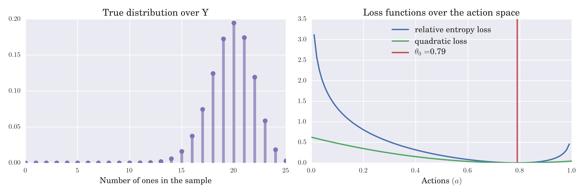
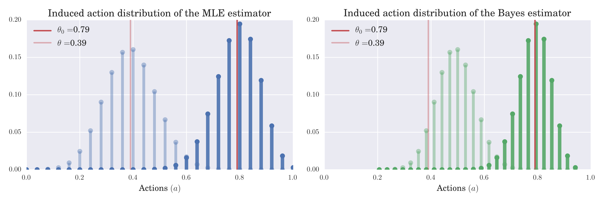
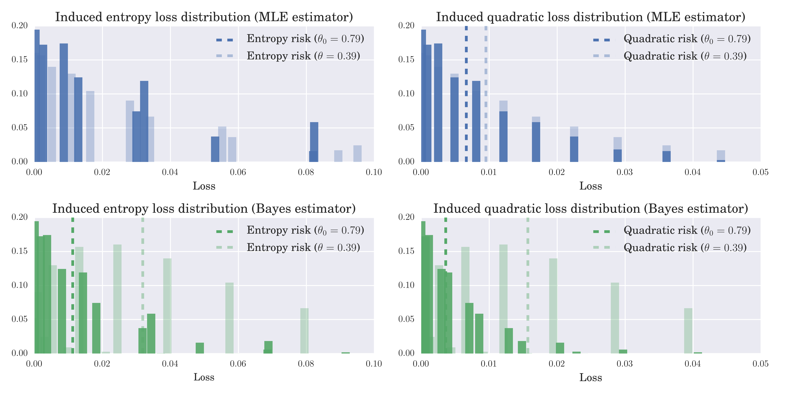
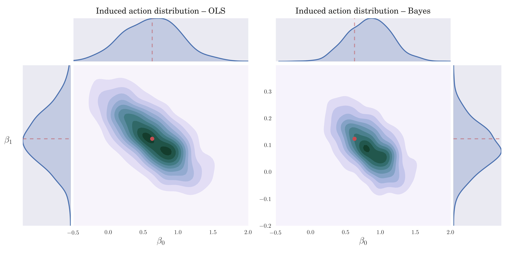
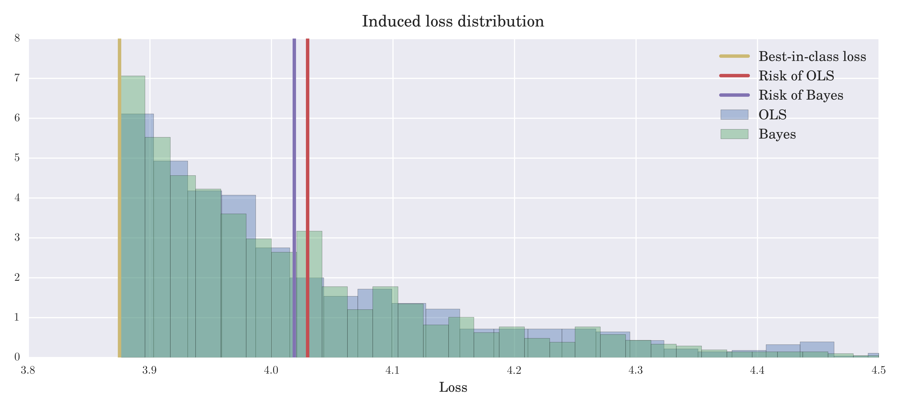

Estimators as Statistical Decision Functions
============================================

**February 2017**

In this notebook we discuss some key concepts of statistical decision
theory in order to provide a general framework for the comparison of
alternative estimators based on their finite sample performance.

-  The primitive object is a statistical decision problem containing a
   loss function, an action space, and a set of assumed statistical
   models. We present estimation problems familiar from econometrics as
   special cases of statistical decision problems. The common framework
   helps highlighting similarities and differences.

-  We compare estimators based on their (finite sample) risk, where risk
   is derived from an unknown true data generating mechanism.

-  We present some straightforward examples to illustrate the main
   ideas.

--------------

Notation
--------

Let :math:`\mathbb{R}` and :math:`\mathbb{Z}` denote the space of reals
and integers, respectively. :math:`\mathbb{R}_+` is the space of
nonnegative real numbers. We use the notation :math:`X^Y` for a function
space that consists of functions mapping from the space :math:`Y` into
the space :math:`X`. As a result, :math:`\mathbb{R}^{d\mathbb{Z}}`
denotes the space of sequences made up of :math:`d`-dimensional real
numbers, while :math:`\mathbb R^{Z}_+` denotes the set of functions
mapping from the range of (random) variable :math:`Z` to the space of
nonnegative reals.

Let :math:`Z_t` be a :math:`d`-dimensional random vector representing
the value that the :math:`d` observables take at period :math:`t`. The
stochastic process :math:`\{Z_t\}_{t\in\mathbb Z}` is denoted by
:math:`Z^{\infty}`, the partial history including :math:`n` consecutive
elements of :math:`Z^{\infty}` is
:math:`Z^{n}:=\{Z_1, Z_2, \dots, Z_n\}`. Small letters stand for
realizations of random variables, hence :math:`z^{\infty}`, :math:`z^n`
and :math:`z` represent the realization of the stochastic process, the
sample and a single observation, respectively.

We use capital letters for distributions, small letter counterparts
denote the associated densities. For example, we use the generic
:math:`Q` notation for ergodic distributions, :math:`q` for the
corresponding density and :math:`q(\cdot|\cdot)` for the conditional
density. Caligraphic letters are used to denote sets:

-  :math:`\mathcal{P}` -- the set of *strictly stationary* probability
   distributions over the observables
-  :math:`\mathcal{Q}\subset \mathcal{P}` -- the set of *ergodic*
   distributions (statistical models) over the observables
-  :math:`\mathcal{F}` -- *admissible space*: abstract function space
   including all functions for which the loss function is well defined

--------------

Introduction
------------

Stationarity and statistical models
~~~~~~~~~~~~~~~~~~~~~~~~~~~~~~~~~~~

We model data as a partial realization of a stochastic process
:math:`Z^{\infty}` taking values in :math:`\mathbb{R}^{d}`. Denote a
particular realization as
:math:`z^{\infty} \in \mathbb{R}^{k\mathbb{Z}}` and let the partial
history :math:`z^{n}` containing :math:`n` consecutive elements of the
realization be the *sample* of size :math:`n`. We assume that there
exists a core mechanism undelying this process that describes the
relationship among the elements of the vector :math:`Z`. Our aim is to
draw inference about this mechanism after observing a single partial
realization :math:`z^{n}`.

How is this possible without being able to draw different samples under
the exact same conditions? Following the exposition of [Breiman-1969]_ fruitful approach is to assume that the underlying mechanism is time invariant with the stochastic process being
strictly stationary and study its statistical properties by taking
long-run time averages of the realization :math:`z^{\infty}` (or
functions thereof), e.g.

.. math:: \lim_{n\to \infty}\frac{1}{n}\sum_{t = 1}^{n} z_t\quad\quad \lim_{n\to \infty}\frac{1}{n} \sum_{t = 1}^{n} z^2_t\quad\quad \lim_{n\to \infty}\frac{1}{n}\sum_{t = k}^{n+k} z_{t}z_{t-k}

Since the mechanism is assumed to be stable over time, it does not
matter when we start observing the process.

Notice, however, that strictly speaking these time averages are
properties of the particular realization, the extent to which they can
be generalized to the mechanism itself is not obvious. To address this
question, it is illuminating to bundle realizations that share certain
statistical properties together in order to construct a universe of
(counterfactual) alternative :math:`z^{\infty}`-s, the so called
*ensemble*. Statistical properties of the data generating mechanism can
be summarized by assigning probabilities to (sets of) these
:math:`z^{\infty}`-s in an internally consistent manner. These
considerations lead to the idea of statistical models.

**Statistical models** are probability distributions over sequences
:math:`z^{\infty}` that assign probabilities so that the unconditional
moments are consistent with the associated long-run time averages. In
other words, with statistical models the time series and ensemble
averages coincide, which is the property known as **ergodicity**.
Roughly speaking, ergodicity allows us to learn about the ensemble
dimension by using a *single* realization :math:`z^{\infty}`.

Dependence
~~~~~~~~~~

In reality, being endowed only with a partial history of
:math:`z^{\infty}`, we cannot calculate the exact log-run time averages.
By imposing more structure on the problem and having a sufficiently
large sample, however, we can obtain reasonable approximations. To this
end, we need to assume some form of weak independence ("mixing"), or
more precisely, the property that on average, the dependence between the
elements of :math:`\{Z_t\}_{t\in\mathbb{Z}}` dies out as we increase the
gap between them.

Consequently, if we observe a *long* segment of :math:`z^{\infty}` and
cut it up into shorter consecutive pieces, say of length :math:`l`,
then, we might consider these pieces (provided that :math:`l` is "large
enough") as nearly independent records from the distribution of the
:math:`l`-block, :math:`Z^l`. To clarify this point, consider a
statistical model :math:`Q_{Z^{\infty}}` (joint distribution over
sequences :math:`z^{\infty}`) with density function
:math:`q_{z^{\infty}}` and denote the implied density of the sample as
:math:`q_{n}`. Note that because of strict stationarity, it is enough to
use the number of consecutive elements as indices. Under general
regularity conditions we can decompose this density as

.. math:: q_{n}\left(z^n\right) = q_{n-1}\left(z_n | z^{n-1}\right)q_{n-1}\left(z^{n-1}\right) = q_{n-1}\left(z_n | z^{n-1}\right)q_{n-2}\left(z_{n-1}|z^{n-2}\right)\dots q_{1}\left(z_{2}|z_1\right)q_{1}\left(z_1\right)

For simplicity, we assume that the stochastic process is Markov so that
the partial histories :math:`z^{i}` for :math:`i=1,\dots, n-1` in the
conditioning sets can be replaced by the "right" number of lags
:math:`z^{n-1}_{n-l}` and we can drop the subindex from the conditional
densties

.. math:: q_{n}(z^n) = q(z_n | z^{n-1}_{n-1-l})q(z_{n-1}|z^{n-2}_{n-2-l})\dots q(z_{l+1}|z_{1}^{l})q_{l}(z^l) \quad\quad\quad (1)

This assumption is much stronger than what we really need. First, it
suffices to require the existence of a history-dependent latent state
variable similar to the Kalman filter. Moreover, we could also relax the
Markov assumption and allow for dependence that dies out only
asymptotically. In practice, however, we often have a stong view about
the dependency structure, or at least we are willing to use economic
theory to guide our choice of :math:`l`. In these cases we almost always
assume a Markovian structure. For simplicity, in these lectures, unless
otherwise stated, we will restrict ourselves to the family of Markov
processes.

This assumption allows us to learn about the underlying mechanism
:math:`Q_{Z^{\infty}}` via its :math:`l+1`-period building blocks. Once
we determine the (ensemble) distribution of the block,
:math:`Q_{Z^{[l+1]}}`, we can "build up" :math:`Q_{Z^{\infty}}` from
these blocks by using a formula similar to (1). Having said that the
block distribution :math:`Q_{Z^{[l+1]}}` carries the same information as
:math:`Q_{Z^{\infty}}`. Therefore, from now on, we define :math:`Z` as
the minimal block we need to know and treat it as an **observation**.
Statistical models can be represented by their predictions about the
ensemble distribution :math:`P` of this observable.

True data generating process
~~~~~~~~~~~~~~~~~~~~~~~~~~~~

We assume that the mechanism underlying :math:`Z^{\infty}` can be
represented with a statistical model :math:`P` and it is called **true
data generating process (DGP)**. We seek to learn about the features of
this model from the observed data.

--------------

Primitives of the problem
-------------------------

Following [Wald-1950]_ every statistical decision problem that we will consider can be
represented with a triple :math:`(\mathcal{H}, \mathcal{A}, L)`, where

1. **Assumed statistical models**,
   :math:`\mathcal{H}\subseteq \mathcal{Q} \subset \mathcal{P}`

   :math:`\mathcal{H}` is a collection of ergodic probability measures
   over the observed data, which captures our *maintained assumptions*
   about the mechanism underlying :math:`Z^{\infty}`. The set of all
   ergodic distributions :math:`\mathcal{Q}` is a strict subset of
   :math:`\mathcal{P}`--the space of strictly stationary probability
   distributions over the observed data. In fact, the set of ergodic
   distributions, :math:`\mathcal{Q}`, constitute the extremum points of
   the set :math:`mathcal{P}`. Ergodicity implies that with infinite
   data we could single out one element from :math:`\mathcal{H}`.

2. **Action space**, :math:`\mathcal{A}\subseteq \mathcal{F}`

   The set of allowable actions. It is an abstract set embodying our
   proposed *specification* by which we aim to capture features of the
   true data generating mechanism. It is a subset of
   :math:`\mathcal{F}`--the largest possible set of functions for which
   the loss function (see below) is well defined.

3. **Loss function**
   :math:`L: \mathcal{P}\times \mathcal{F} \mapsto \mathbb{R}_+`

   The loss function measures the performance of alternative actions
   :math:`a\in \mathcal{F}` under a given distribution
   :math:`P\in \mathcal{P}`. In principle, :math:`L` measures the
   distance between distributions in :math:`\mathcal{P}` along
   particular dimensions determined by features of the data generating
   mechanism that we are interested in. By assigning zero distance to
   models that share a particular set of features (e.g. conditional
   expectation, set of moments, etc.), the loss function can 'determine'
   the relevant features of the problem.

Given the assumed statistical models, we can restrict the domain of the
loss function without loss in generality such that,
:math:`L: \mathcal{H}\times\mathcal{A}\mapsto\mathbb{R}_+`.

--------------

Examples
~~~~~~~~

**Quadratic loss:**

The most commonly used loss function is the quadratic

.. math:: L(P, a) = \int \lVert z - a \rVert^2\mathrm{d}P(z)

where the admissible space is
:math:`\mathcal{F}\subseteq \mathbb{R}^{k}`. Another important case is
when we can write :math:`Z = (Y, X)`, where :math:`Y` is univariate and
the loss function is

.. math:: L(P, a) = \int (y - a(x))^2\mathrm{d}P(y, z)

and the admissible space :math:`\mathcal{F}` contains all square
integrable real functions of :math:`X`.

**Relative entropy loss:**

When we specificy a whole distribution and are willing to approximate
:math:`P`, one useful measure for comparison of distributions is the
Kullback-Leibler divergence, or relative entropy

.. math:: L(P, a) = - \int \log \frac{p}{a}(z) \mathrm{d}P(z)

in which case the admissible space is the set of distributions which
have a density (w.r.t. the Lebesgue measure)
:math:`\mathcal{F} = \{a: Z \mapsto \mathbb{R}_+ : \int a(z)\mathrm{d}z=1\}`.

**Generalized Method of Moments:**

Following the exposition of [Manski-1988]_, many
econometric problems can be cast as solving the equation
:math:`T(P, \theta) = \mathbf{0}` in the parameter :math:`\theta`, for a
given function :math:`T: \mathcal{P}\times\Theta \mapsto \mathbb{R}^m`
with :math:`\Theta` being the parameter space. By expressing estimation
problems in terms of unconditional moment restrictions, for example, we
can write
:math:`T(P, \theta) = \int g(z; \theta)\mathrm{d}P(z) = \mathbf{0}` for
some function :math:`g`. Taking an *origin-preserving continuous
transformation* :math:`r:\mathbb{R}^m \mapsto \mathbb{R}_+` so that

.. math:: T(P, \theta) = \mathbf{0} \iff r(T)=0

we can present the problem in terms of minimizing a particular loss
function. Define the admissible space as :math:`\mathcal{F} = \Theta`,
then the method of moment estimator minimizes the loss
:math:`L(P, \theta) = r\circ T(P, \theta)`. The most common form of
:math:`L` is

.. math:: L(P, \theta) = \left[\int g(z; \theta)\mathrm{d}P(z)\right]' W \left[\int g(z; \theta)\mathrm{d}P(z)\right]

where :math:`W` is a :math:`m\times m` positive-definite weighting
matrix.

--------------

Features and the best-in-class action
~~~~~~~~~~~~~~~~~~~~~~~~~~~~~~~~~~~~~

By using a loss function, we acknowledge that learning about the true
mechanism might be too ambitious, so we better focus our attention only
on certain features of it and try to approximate those with our
specification. The loss function expresses our assessment about the
importance of different features and about the penalty used to punish
deviations from the true features. We define the **feature functional**
:math:`\gamma: \mathcal{P}\mapsto \mathcal{F}` by the following
optimization over the admissible space :math:`\mathcal{F}`

.. math:: \gamma(P) := \arg\min_{a \in \mathcal{F}} \ L(P,a)

and say that :math:`\gamma(P)` captures the features of :math:`P` that
we wish to learn about. It follows that by changing :math:`L` we are
effectively changing the features of interest.

If one knew the data generating process, there would be no need for
statistical inference. What makes the problem statistical is that the
distribution :math:`P` describing the environment is unknown. The
statistician must base her action on the available data, which is a
partial realization of the underlying data generating mechanism. As we
will see, this lack of information implies that for statistical
inference the whole admissible space :math:`\mathcal F` is almost always
"too large". As a result, one typically looks for an approximation in a
restricted action space :math:`\mathcal{A}\subsetneq \mathcal{F}`, for
which we define the **best-in-class action** as follows

.. math:: a^*_{L,\ P,\ \mathcal{A}} := \arg\min_{a \in \mathcal{A}} \ L(P,a).

Whith a restricted action space, this best-in-class action might differ
from the true feature :math:`\gamma(P)`. We can summarize this scenario
compactly by :math:`\gamma(P)\notin \mathcal{A}` and saying that our
specification embodied by :math:`\mathcal{A}` is **misspecified**.
Naturally, in such cases properties of the loss function become crucial
by specifying the nature of punishments used to weight deviations from
:math:`\gamma(P)`. We will talk more about misspecification in the
following sections. A couple of examples should help clarifying the
introduced concepts.

-  **Conditional expectation -- regression function estimation**
   Consider the quadratic loss function over the domain of all
   square integrable functions :math:`L^2(X, \mathbb{R})` and let
   :math:`Z = (Y, X)`, where :math:`Y` is a scalar. The
   corresponding feature is

.. math:: \gamma(P) = \mathbb{E}[Y|X] = \arg\min_{a \in L^2(X)} \int\limits_{(Y,X)} (y - a(x))^2\mathrm{d}P(y, x)

If the action space :math:`\mathcal{A}` does not include all square
integrable functions, but only the set of affine functions, the best
in class action, i.e., the linear projection of :math:`Y` to the
space spanned by :math:`X`, will be different from :math:`\gamma(P)`
in general. In other words, the linear specification for the
conditional expectation :math:`Y|X` is misspecified.

-  **Density function estimation** Consider the Kullback-Leibler
   distance over the set of distributions with existing density
   functions. Denote this set by :math:`D_Z`. Given that the true
   :math:`P\in D_Z`, the corresponding feature is

.. math:: \gamma(P) = \arg\min_{a \in D_Z} \int\limits_{Z}\log\left(\frac{p(z)}{a(z)}\right) \mathrm{d}P(z)

which provides the density :math:`p\in\mathbb{R}_+^Z` such that
:math:`\int p(z)\mathrm{d}z =1` and for any sensible set
:math:`B\subseteq \mathbb{R}^k`,
:math:`\int_B p(z)\mathrm{d}z = P(B)`. If the action space
:math:`\mathcal{A}` is only a parametric subset of :math:`D_Z`, the
best in class action will be the best approximation in terms of
KLIC. For an extensive treatment see [White-1994]_.

Statistical models vs. specifications
~~~~~~~~~~~~~~~~~~~~~~~~~~~~~~~~~~~~~

An important aspect of the statistical decision problem is the
relationship between :math:`\mathcal{H}` and :math:`\mathcal{A}`. Our
*maintained assumptions* about the mechanism are embodied in
:math:`\mathcal{H}`, so a natural attitude is to be as agnostic as
possible about :math:`\mathcal{H}` in order to avoid incredible
assumptions. Once we determined :math:`\mathcal{H}`, the next step is to
choose the specification, that is the action space :math:`\mathcal{A}`.

-  One approach is to tie :math:`\mathcal{H}` and :math:`\mathcal{A}`
   together. For example, the assumptions of the standard linear
   regression model outline the distributions contained in
   :math:`\mathcal{H}` (normal with zero mean and homoscedasticity), for
   which the natural action space is the space of affine functions.

-  On the other hand, many approaches explicitly disentangle
   :math:`\mathcal{A}` from :math:`\mathcal{H}` and try to be agnostic
   about the maintained assumptions :math:`\mathcal{H}` and rather
   impose restrictions on the action space :math:`\mathcal{A}`. At the
   cost of giving up some potentially undominated actions this approach
   can largely influence the success of the inference problem in finite
   samples.

By choosing an action space not being tied to the set of assumed
statistical models, the statistician inherently introduces a possibility
of misspecification -- for some statistical models there could be an
action outside of the action space which would fare better than any
other action within :math:`\mathcal{A}`. However, coarsening the action
space in this manner has the benefit of restricting the variability of
estimated actions arising from the randomness of the sample.

In this case, the best-in-class action has a special role, namely, it
minimizes the "distance" between :math:`\mathcal{A}` and the true
feature :math:`\gamma(\mathcal A)`, thus measuring the benchmark bias
stemming from restricting :math:`\mathcal{A}`.

--------------

Example - Coin tossing
----------------------

The observable is a binary variable :math:`Z\in\{0, 1\}` generated by
some statistical model. One might approach this problem by using the
following triple

-  *Assumed statistical models*, :math:`\mathcal{H}`:

   -  :math:`Z` is generated by an i.i.d. Bernoulli distribution, i.e.
      :math:`\mathcal{H} = \{P(z; \theta): \theta \in[0,1]\}`
   -  The probability mass function associated with the distribution
      :math:`P(z;\theta)\in\mathcal{H}` has the form

.. math:: p(z; \theta) = \theta^z(1-\theta)^{1-z}.

-  *Action space*, :math:`\mathcal{A}`:

   -  Let the action space be equal to :math:`\mathcal{H}`, that is
      :math:`\mathcal{A} = \{P(z, a): a\in[0,1]\} = \mathcal{H}`.

-  *Loss function*, :math:`L`: We entertain two alternative loss
   functions

   -  Relative entropy

   .. math:: L_{RE}(P, a) = \sum_{z\in\{0,1\}} p(z;  \theta)\log \frac{p(z; \theta)}{p(z; a)} = E_{\theta}[\log p(z; \theta)] - E_{\theta}[\log p(z; a)]

   - Quadratic loss

.. math:: L_{MSE}(P, a) = \sum_{z\in\{0,1\}} p(z;  \theta)(\theta - a)^2 = E_{\theta}[(\theta - a)^2]

where :math:`E_{\theta}` denotes the expectation operator with respect
to the distribution :math:`P(z; \theta)\in\mathcal{H}`.

--------------

Example - Linear regression function
------------------------------------

In the basic setup of regression function estimation we write
:math:`Z=(Y,X)\in\mathbb{R}^2` and the objective is to predict the value
of :math:`Y` as a function of :math:`X` by penalizing the deviations
through the quadratic loss function. Let
:math:`\mathcal{F}:= \{f:X \mapsto Y\}` be the family of square
integrable functions mapping from :math:`X` to :math:`Y`. The following
is an example for a triple

-  *Assumed statistical models*, :math:`\mathcal{H}`

   -  :math:`(Y,X)` is generated by an i.i.d. joint Normal distribution,
      :math:`\mathcal{N}(\mu, \Sigma)`, implying that the true
      regression function, i.e. conditional expectation, is affine.

-  *Action space*, :math:`\mathcal{A}`

   -  The action space is the set of affine functions over :math:`X`,
      i.e.
      :math:`\mathcal{A}:= \{a \in \mathcal{F} : a(x) = \beta_0 + \beta_1 x\}`.

-  *Loss function*, :math:`L`

   -  Quadratic loss function

.. math:: L(P, f) = \int\limits_{(Y,X)}(y - f(x))^2\mathrm{d}P(y,x)

--------------

Statistical Decision Functions
------------------------------

.. raw:: html

   <!---
   The time invariant stochastic relationship between the data and the environment allows the decision maker to carry out statistical inference regarding the data generating process.
   --->

A **statistical decision function** (or statistical decision rule) is a
function mapping samples (of different sizes) to actions from
:math:`\mathcal{A}`. In order to flexibly talk about the behavior of
decision rules as the sample size grows to infinity, we define the
domain of the decision rule to be the set of samples of all potential
sample sizes, :math:`\mathcal{S}:= \bigcup_{n\geq1}Z^n`. The decision
rule is then defined as a sequence of functions

.. math::  d:\mathcal{S} \mapsto \mathcal{A} \quad \quad \text{that is} \quad \quad \{d(z^n)\}_{n\geq 1}\subseteq \mathcal{A},\quad \forall z^{n}, \forall n\geq 1. 

--------------

Example (cont) - estimator for coin tossing
~~~~~~~~~~~~~~~~~~~~~~~~~~~~~~~~~~~~~~~~~~~

One common way to find a decision rule is to plug the empirical
distribution :math:`P_{n}` into the loss function :math:`L(P, a)` to
obtain

.. math:: L_{RE}\left(P_{n}; a\right) = \frac{1}{n}\sum_{i = 1}^{n} \log \frac{p(z_i; \theta)}{p(z_i; a)}\quad\quad\text{and}\quad\quad L_{MSE}\left(P_{n}; a\right) = \frac{1}{n}\sum_{i = 1}^{n} (z_i -a)^2

and to look for an action that minimizes this sample analog. In case of
relative entropy loss, it is

.. math:: d(z^n) := \arg \min_{a} L(P_{n}, a) = \arg\max_{a\in[0,1]} \frac{1}{n}\sum_{i=1}^{n} \log f(z_i ,a) = \arg\max_{a\in[0,1]}  \frac{1}{n}\underbrace{\left(\sum_{i=1}^{n} z_i\right)}_{:= y}\log a + \left(\frac{n-y}{n}\right)\log(1-a) 

where we define the random variable :math:`Y_n := \sum_{i = 1}^{n} Z_i`
as the number of :math:`1`\ s in the sample of size :math:`n`, with
:math:`y` denoting a particular realization. The solution of the above
problem is the *maximum likelihood estimator* taking the following form

.. math:: \hat{a}(z^n) = \frac{1}{n}\sum_{i=1}^{n} z_i = \frac{y}{n}

and hence the **maximum likelihood** decision rule is

.. math:: d_{mle}(z^n) = P(z, \hat{a}(z^n)).

It is straightforward to see that if we used the quadratic loss instead
of relative entropy, the decision rule would be identical to
:math:`d_{mle}(z^n)`. Nonetheless, the two loss functions can lead to
very different assessment of the decision rule as will be shown below.

--------------

For comparison, we consider another decision rule, a particular Bayes
estimator (posterior mean), which takes the following form

.. math:: d_{bayes}(z^n) = P(z, \hat{a}_B(z^n))\quad\quad\text{where}\quad\quad \hat{a}_B(z^n) = \frac{\sum^{n}_{i=1} z_i + \alpha}{n + \alpha + \beta} = \frac{y + \alpha}{n + \alpha + \beta}

where :math:`\alpha, \beta > 0` are given parameters of the Beta prior.
Later, we will see how one can derive such estimators. What is important
for us now is that this is an alternative decision rule arising from the
same triple :math:`(\mathcal{H}, \mathcal{A}, L_{MSE})` as the maximum
likelihood estimator, with possibly different statistical properties.

--------------

Example (cont) - estimator for linear regression function
~~~~~~~~~~~~~~~~~~~~~~~~~~~~~~~~~~~~~~~~~~~~~~~~~~~~~~~~~

In this case the approach that we used to derive the maximum likelihood
estimator in the coin tossing example leads to the following sample
analog objective function

.. math::  d_{OLS}(z^n):= \arg\min_{a \in \mathcal{A}}L(P_{n},a) = \arg\min_{\beta_0, \ \beta_1} \sum_{t=1}^n (y_t - \beta_0 - \beta_1 x_t)^2. 

With a bit of an abuse of notation redefine :math:`X` to include the
constant for the intercept, i.e.
:math:`\mathbf{X} = (\mathbf{\iota}, x^n)`. Then the solution for the
vector of coefficients, :math:`\mathbf{\beta}=(\beta_0, \beta_1)`, in
the ordinary least squares regression is given by

.. math:: \hat{\mathbf{\beta}}_{OLS} := (\mathbf{X}^T \mathbf{X})^{-1}\mathbf{X}^T \mathbf{Y}. 

Hence, after sample :math:`z^n`, the decision rule predicts :math:`y` as
an affine function given by :math:`d_{OLS}(z^n) = \hat{a}_{OLS}` such
that

.. math::  \hat{a}_{OLS}(x) := \langle \mathbf{\hat{\beta}}_{OLS}, (1, x) \rangle 

where :math:`\langle \cdot, \cdot \rangle` denotes the inner product on
:math:`\mathbb R^{2}`.

--------------

Again, for comparison we consider a Bayesian decision rule where the
conditional prior distribution of :math:`\beta` is distributed as
:math:`\beta|\sigma \sim \mathcal{N}(\mu_b, \sigma^2\mathbf{\Lambda_b}^{-1})`.
Then the decision rule is given by

.. math::  \hat{\mathbf{\beta}}_{bayes} := (\mathbf{X}^T \mathbf{X} + \mathbf{\Lambda_b})^{-1}(\mathbf{\Lambda_b} \mu_b + \mathbf{X}^T \mathbf{Y}). 

Hence, decision rule after sample :math:`z^n` is an affine function
given by :math:`d_{bayes}(z^n) = \hat{a}_{bayes}` such that

.. math::  \hat{a}_{bayes}(x) := \langle \mathbf{\hat{\beta}}_{bayes}, (1, x) \rangle. 

Again, our only purpose here is to show that we can define alternative
decision rules for the same triple
:math:`(\mathcal{H}, \mathcal{A}, L_{MSE})` which might exhibit
different statistical properties.

--------------

Induced Distributions over Actions and Losses
---------------------------------------------

For a given sample :math:`z^n`, the decision rule assigns an action
:math:`d(z^n)\in\mathcal{A}`, which is then evaluated with the loss
function :math:`L(P, d(z^n))` using a particular distribution
:math:`P\in\mathcal{H}`. Evaluating the decision rule and the loss
function with a single sample, however, does not capture the uncertainty
arising from the randomness of the sample. To get that we need to assess
the decision rule in counterfactual worlds with different realizations
for :math:`Z^n`.

For each possible data generating mechanism, we can characterize the
properties of a given decision rule by considering the distribution that
it induces over losses. It is instructive to note that the decision rule
:math:`d` in fact gives rise to

-  **induced action distribution:** distribution induced by :math:`d`
   over the action space, :math:`\mathcal{A}`
-  **induced loss distribution:** distribution induced by :math:`d` over
   the loss space, i.e. :math:`\mathbb{R}_+`.

This approach proves to be useful as the action space can be an abstract
space with no immediate notion of metric while the range of the loss
function is always the real line (or a subset of it). In other words, a
possible way to compare different decision rules is to compare the
distributions they induce over losses under different data generating
mechanisms for a fixed sample size.

Evaluating Decision Functions
~~~~~~~~~~~~~~~~~~~~~~~~~~~~~

Comparing distributions, however, is often an ambiguous task. A special
case where one could safely claim that one decision rule is better than
another is if the probability that the loss is under a certain :math:`x`
level is always greater for one decision rule than the other. For
instance, we could say that :math:`d_1` is a better decision rule than
:math:`d_2` relative to :math:`\mathcal{H}` if for all
:math:`P\in\mathcal{H}`

.. math::  P\{z^n: L(P, d_1(z^n)) \leq x\} \geq P\{z^n: L(P, d_2(z^n)) \leq x\} \quad \forall \ x\in\mathbb{R} 

which is equivalent to stating that the induced distribution of
:math:`d_2` is *first-order stochastically dominating* the induced
distribution of :math:`d_1` for every :math:`P\in\mathcal{H}`. This, of
course, implies that

.. math::  \mathbb{E}[L(P, d_1(z^n))] \leq \mathbb{E}[L(P, d_2(z^n))]

where the expectation is taken with respect to the sample distributed
according to :math:`P`.

In fact, the expected value of the induced loss is the most common
measure to evaluate decision rules. Since the loss is defined over the
real line, this measure always gives a single real number which serves
as a basis of comparison for a given data generating process. The
expected value of the loss induced by a decision rule is called **the
risk** of the decision rule and is denoted by

.. math:: R_n(P, d) = \mathbb{E}[L(P, d(z^n))].

This functional now provides a clear and straightforward ordering of
decision rules so that :math:`d_1` is preferred to :math:`d_2` for a
given sample size :math:`n`, if
:math:`R_n(P, d_1) < R_n\left(P, d_2\right)`. Following this logic, it
might be tempting to look for the decision rule that is optimal in terms
of finite sample risk. This problem, however, is immensly complicated
because its criterion function hinges on an object, :math:`P`, that we
cannot observe.

Nonetheless, statistical decision theory provides a very useful common
framework in which different approaches to constructing decision rules
can be analyzed, highlighting their relative strengths and weaknesses.
In notebook3 and notebook4 {REF to notebooks} we will consider three
approaches, each of them having alternative ways to handle the ignorance
about the true risk.

1. **Classical approach:** where the main assessment of a decision rule
   is based on its asymptotic properties.
2. **Bayesian approach:** where the ignorance about :math:`P` is
   resolved by the use of a prior.
3. **Statistical learning theory approach:** where a decision rule is
   judged according to its performance under the least favorable
   (worst-case) distribution.

--------------

Example (cont) - induced distributions for coin tossing
~~~~~~~~~~~~~~~~~~~~~~~~~~~~~~~~~~~~~~~~~~~~~~~~~~~~~~~

Consider the case when the true data generating process is indeed i.i.d.
Bernoulli with parameter :math:`\theta_0`. This implies that we have a
correctly sepcified model. The sample that we are endowed with to use
for inference has the size :math:`n=25`.

-  The left panel in the following figure represents the distribution of
   the sample. More precisely, the different sample realizations
   :math:`z^n` have equal probability, but because all information
   contained in a given sample can be summerized by the sum of
   :math:`1`\ s, :math:`Y=\sum_{t=1}^{n} Z_t` and :math:`Y` is a
   sufficient statistic, we plot the distribution of :math:`Y` instead.
-  The right panel shows the shapes of the two loss functions that we
   are considering. Notice that while quadratic loss is symmetric,
   relative entropy loss is asymmetric. That is, although both loss
   functions give rise to the same decision rule, we see that they
   punish deviations from the truth (red vertical line) quite
   differently. In particular, the entropy loss is unbounded over the
   domain: at :math:`a=0` and :math:`a=1` its value is undefined (or
   takes infinity).

The left and right panels of the following figure shows the induced
action distributions of the MLE and Bayes decision rules (when
:math:`\alpha=5`, :math:`\beta=2`) respectively for two alternative
values of :math:`\theta_0`. More transparent colors denote the scenario
corresponding to the sample distribution of last figure. Faded colors
show the distributions induced by an alternative :math:`\theta_0`, while
the prior parameters of the Bayes decision rule are kept fixed.

-  **Bias vs. variance:** The MLE estimator is unbiased in the sense
   that its mean always coincide with the true :math:`\theta_0`. In
   contrast, the Bayes estimator is biased, the extent of which depends
   on the relationship between the prior parameters and the true value:
   when the prior concentrates near :math:`\theta_0`, the bias is small,
   but as the faded distributions demonstrate, for other
   :math:`\theta_0`\ s the bias can be significant. Notice, however,
   that :math:`d_{bayes}` is always less dispersed than :math:`d_{mle}`,
   in the sense that the values to which it assigns positive probability
   are more densely placed in :math:`[0, 1]`. Exploiting this trade-off
   between bias and variance will be a crucial device in finding
   decision rules with low risk.

Finally, the figure below compares the performance of the two decision
rules according to the their finite sample risk. The first row
represents the induced loss distribution of the MLE estimator for the
relative entropy and quadratic loss functions. The two panels of the
second row show the same distributions for the Bayes decision rule. The
vertical dashed lines indicate the value of the respective risk
functionals.

-  **Loss function matters:** For all sample sizes, the probability mass
   function of the MLE estimator assigns positive probability to both
   :math:`a=0` and :math:`a = 1`, whereas the support of the Bayes
   estimator lies always in the interior :math:`(0, 1)`. This difference
   has significant consequences for the relative entropy risk, because
   as we saw above :math:`L_{RE}` is undefined at the boundaries of
   :math:`[0, 1]`. As a result, the relative entopy risk of the MLE
   estimator does not exist and so the Bayes estimator always wins in
   terms of realative entropy. The secret of :math:`d_{bayes}` is to
   shrink the effective action space.
-  **Dependence on:** :math:`\theta_0` Comparing the decision rules in
   terms of the quadratic loss reveals that the true :math:`\theta_0` is
   a critical factor. It determines the size of the bias (hence the
   risk) of the Bayes estimator. Since :math:`\theta_0` is unknown, this
   naturally introduces a subjective (not data driven) element into our
   analysis: when the prior happens to concentrate around the true
   :math:`\theta_0` the Bayes estimator performs better than the MLE,
   otherwise the bias could be so large that it flips the ordering of
   decision rules.

--------------

Example (cont) - induced distributions for linear regression
~~~~~~~~~~~~~~~~~~~~~~~~~~~~~~~~~~~~~~~~~~~~~~~~~~~~~~~~~~~~

Suppose that our model is correctly specified. In particular, let the
data generating mechanism be i.i.d. with

.. math::

    (Y,X) \sim \mathcal{N}(\mu, \Sigma) \quad\quad \text{where}\quad\quad  \mu = (1, 3)\quad \text{and}\quad \Sigma = 
   \begin{bmatrix}
       4  & 1 \\
       1 & 8
   \end{bmatrix}.

Under this data generating mechanism, the optimal regression function is
affine with coefficients

.. math::

   \begin{align}
   \beta_0 &= \mu_Y - \rho\frac{\sigma_Y}{\sigma_X}\mu_X = 1 - \frac{1}{8} 3 = -0.625, \\
   \beta_1 &= \rho\frac{\sigma_Y}{\sigma_X} = \frac{1}{8} = 0.125.
   \end{align}

Due to correct specification, these coefficients in fact determine the
feature, i.e. the true regression function.

For the Bayes estimator consider the prior

.. math::

   \mu \sim \mathcal{N}\left(\mu_b, \Lambda_b^{-1}\right) \quad\quad \text{where}\quad\quad  \mu_b = (2, 2)\quad \text{and}\quad \Lambda_b = 
   \begin{bmatrix}
       6  & -3 \\
       -3 & 6
   \end{bmatrix}

and suppose that :math:`\Sigma` is known. Let the sample size be
:math:`n=50`. With the given specification we can *simulate* the induced
action and loss distributions.

The following figure shows contour plots of the induced action
distributions associated with the OLS and Bayes estimators. The red dot
depicts the best-in-class action.

-  One can see that the OLS estimator is unbiased in the sense that the
   induced action distribution concentrates around the best-in-class
   action. In contrast, the Bayes estimator exhibits a slight bias.
-  On the other hand, the variance of the Bayes decision rule is smaller
   than that of the OLS estimator.

Using quadrature methods one can calculate the loss of each action which
gives rise to the induced loss distribution. As an approximation to
these induced loss distributions, the following figure shows the
histograms emerging from these calculations.

-  In terms of risk the slightly bigger bias of the Bayes estimate is
   compensated by its lower variance (across the different sample
   realizations). As a result, in this particular example, the risk of
   the Bayes decision rule is lower than that of the OLS estimator.
-  The true feature lies within the action space and the model is very
   "simple", hence it's difficult to beat the OLS (we need small sample
   and large noise). Using a more complex or misspecified model this
   might not be the case.

--------------

Misspecification and the bias-variance dilemma
----------------------------------------------

In the above examples we maintained the assumption of correctly
specified models, i.e., the true feature of the data generating process
lied within the action set :math:`\mathcal{A}`. In applications using
nonexperimental data, however, it is more reasonable to assume that the
action set contains only approximations of the true feature.

Nothing in the analysis above prevents us from entertaining the
possibility of misspecification. In these instances one can look at
:math:`a^{*}_{L, P, \mathcal{A}}` as the best approximation of
:math:`\gamma(P)` achievable by the model specification
:math:`\mathcal{A}`. For example, even though the true regression
function (conditional expectation) might not be linear, the exercise of
estimating the *best linear approximation* of the regression function is
well defined.

In theory, one can investigate the approximation error emerging from a
misspecified :math:`\mathcal{A}` via the loss function without
mentioning the inference (finite sample) problem at all. In particular,
the **misspecification error** can be defined as

.. math:: \min_{a\in\mathcal{A}} \ L(P,a) - L(P, \gamma(P))

This naturally leads to a dilemma regarding the "size" of the action
space: with a richer :math:`\mathcal{A}`, in principle, we can get
closer to the true feature by making the misspecification error small.
Notice, however, that in practice, not knowing :math:`P` implies that we
cannot solve the above optimization problem and obtain the best-in-class
action. As we show in notebook2 {REF}, a possible way to proceed is to
require the so called *consistency* property from our decision rule by
which we can guarantee to get very close to
:math:`a^{*}_{L, P, \mathcal{A}}` with *sufficiently large* samples,
however, what "sufficently large" means will be determined by the size
of our :math:`\mathcal{A}`. Larger action spaces will require larger
samples to get sensible estimates for the best-in-class action. In fact,
by using a "too large" :math:`\mathcal{A}` accompanied with a "too
small" sample, our estimator's performance can be so bad that
misspecification concerns become secondary.

In other words, finiteness of the sample gives rise to a trade-off
between the severity of misspecifiation and the credibility of our
estimates. To see this, decompose the deviation of the finite sample
risk from the value of loss at the truth (excess risk) for a given
decision rule :math:`d` and sample size :math:`n`:

.. math:: R_n(P, d) - L\left(P, \gamma(P) \right) = \underbrace{R_n(P, d) - L\left(P, a^{*}_{L,P, \mathcal{A}}\right)}_{\text{estimation error}} + \underbrace{L\left(P, a^{*}_{L, P, \mathcal{A}}\right)- L\left(P, \gamma(P)\right)}_{\text{misspecification error}}

While the estimation error stems from the fact that we do not know
:math:`P`, so we have to use a finite sample to approximate the
best-in-class action, misspecification error, not influenced by any
random object, arises from the necessity of
:math:`\mathcal{A}\subsetneq\mathcal{F}`.

This trade-off resembles the bias-variance dilemma well-known from
classical statistics. Statisticians often connect the estimation error
with the decision rule's variance, whereas the misspecification error is
considered as the bias term. We will see in notebook3 {REF} that this
interpretation is slightly misleading. Nonetheless, it is true that,
similar to the bias-variance trade-off, manipulation of (the size of)
:math:`\mathcal{A}` is the key device to address the
estimation-misspecification error trade-off. The minimal excess risk can
be reached by the action space where the following two forces are
balanced {REF to figure in notebook3}:

-  the estimation error (variance) is increasing in the size of
   :math:`\mathcal{A}`,
-  the misspecification error (bias) is weakly decreasing in the size of
   :math:`\mathcal{A}`.

In the next lecture {REF: notebook2}, we will give a more elaborate
definition of what do we mean by the "size" of :math:`\mathcal{A}`.

**A warning**

The introduced notion of misspecification is a *statistical* one. From a
modeller's point of view, a natural question to ask is to what extent
misspecification affects the economic interpretation of the parameters
of a fitted statistical model. Intuitively, a necessary condition for
the sensibility of economic interpretation is to have a correctly
specified statistical model. Because different economic models can give
rise to the same statistical model, this condition is by no means
sufficient. From this angle, a misspecified statistical model can easily
invalidate any kind of economic interpretation of estimated parameters.
This issue is more subtle and it would require an extensive treatment
that we cannot deliver here, but it is worth keeping in mind the list of
very strong assumptions that we are (implicitly) using when we give
well-defined meaning to our parameter estimates. An interesting
discussion can be found in Chapter 4 of [White-1994]_.

--------------

The code used for the simulations and generating the graphs can be found under the following link_.

.. _link: https://github.com/QuantEcon/econometrics/blob/master/Notebook_01_wald/statistical_decision_functions_code.ipynb

--------------

References
~~~~~~~~~~

.. [Breiman-1969] Breiman, Leo (1969). Probability and Stochastic Processes: With a View Towards Applications. Houghton Mifflin.

.. [Wald-1950] Wald, Abraham (1950). Statistical Decision Functions. John Wiley and Sons, New York.

.. [Manski-1988] Manski, Charles (1988). Analog estimation in econometrics. Chapman and Hall, London.

.. [White-1994] White, Halbert (1994). Estimation, Inference and Specification Analysis (Econometric Society Monographs). Cambridge University Press.

